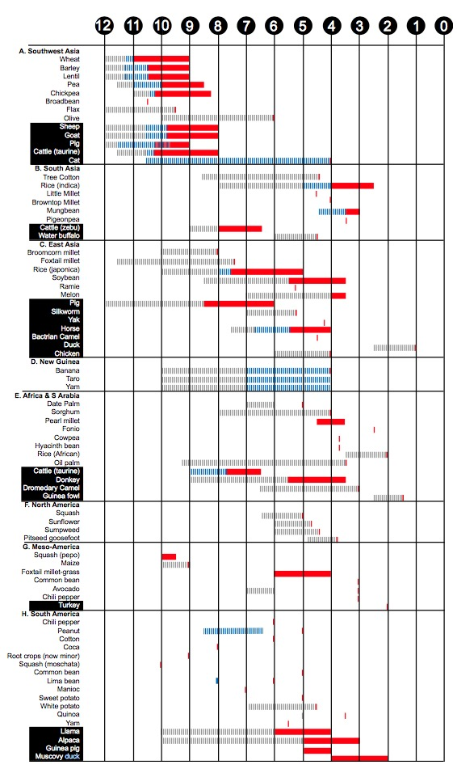
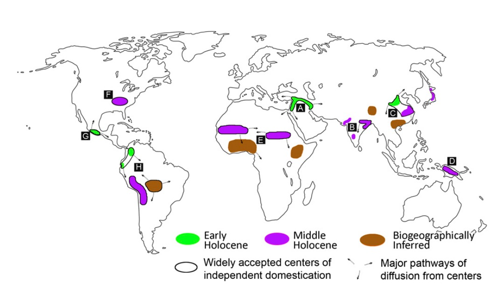
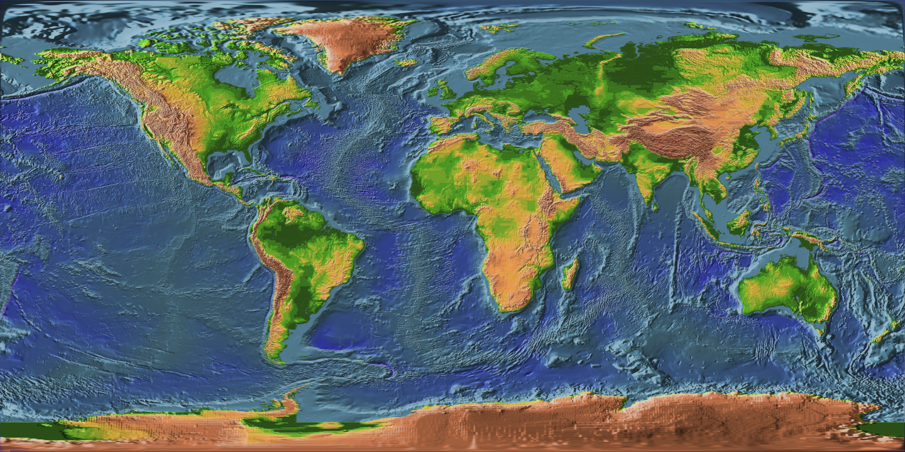

## Current best version


## Code
1. [R environment setup](#r-environment-setup)
2. [Setting time breaks](#setting-time-breaks)
3. [Defining origins](#defining-origins)
4. [Import raster data](#import-raster-data)
5. [GAM smoothing models](#gam-smoothing-models)
6. [Compare rates between origins and not-origins](#compare-rates-between-origins-and-not-origins)
7. [Compare rates between different time periods](#compare-rates-between-different-time-periods)
8. [Setup final figure](#setup-final-figure)
9. [Map for final figure](#map-for-final-figure)
10. [Trend through time panel for final figure](#trend-through-time-panel)
11. [Assemble and print final figure](#assemble-the-figure)


## R environment setup
#### Attach libraries
```{r}
library(png)
library(maptools)
library(raster)
library(gam)
```


#### Set working directory
```{r}
setwd("~/Desktop/Botero postdoc 2016/Human density and the origins of agriculture/")
```


## Setting time breaks
#### Define the times of agricultural origins


```{r}
par(mar=c(0,0,0,20))
d <- readPNG("Larson_dates.png")
plot(seq(0,18, length.out = 19), seq(0,36, length.out = 19), type="n",ylim=c(0,36),xlim=c(0, 18), xaxt="n")

rasterImage(d, 0,0,18,36, interpolate=TRUE, col=d)


Start_of_early_window <- 16-12
End_of_early_window_start_of_late_window <- 8.2
End_of_late_window <- 17-4.2

polygon(x=c(Start_of_early_window, Start_of_early_window, End_of_early_window_start_of_late_window, End_of_early_window_start_of_late_window), y=c(0, 34, 34, 0), col=adjustcolor("limegreen", alpha= 0.2), border=adjustcolor("limegreen", alpha= 0.9))

polygon(x=c( End_of_early_window_start_of_late_window, End_of_early_window_start_of_late_window, End_of_late_window, End_of_late_window), y=c(0, 34, 34, 0), col=adjustcolor("firebrick", alpha= 0.2), border=adjustcolor("firebrick", alpha= 0.9))

```


These dates are provided in the supplimentary information for the Larson (2014) paper. I've copied those values into a .csv table provided here. 

```{r}
domestication_times <- read.csv("Domestication timing larson 2014.csv")

dim(domestication_times)
```

```{r, echo=FALSE}
library(knitr) 
kable(domestication_times, caption= "This is our world")
```


```{r}
par(mar=c(5,4,6,1))

dates <- unlist(domestication_times[3:8])
hist(dates, breaks = 22, xlim=c(15,0), xlab="K years ago", col=adjustcolor("cornflowerblue", alpha= 0.5), border=adjustcolor("cornflowerblue", alpha= 0.9), main="All dates in dataset"  )
mtext("This tells us about how evenly our evidence is distributed in time", 3, line=1)


```

```{r}
hist(dates, breaks = 22, xlim=c(15,0), xlab="Thousand years ago", col=adjustcolor("cornflowerblue", alpha= 0.5), border=adjustcolor("cornflowerblue", alpha= 0.9), main="All dates in dataset with Larson(2014) date windows")

Start_of_early_window <- 12
End_of_early_window_start_of_late_window <- 8.2
End_of_late_window <- 4.2

polygon(x=c(Start_of_early_window, Start_of_early_window, End_of_early_window_start_of_late_window, End_of_early_window_start_of_late_window), y=c(0, 30, 30, 0), col=adjustcolor("limegreen", alpha= 0.2), border=adjustcolor("limegreen", alpha= 0.9))

polygon(x=c( End_of_early_window_start_of_late_window, End_of_early_window_start_of_late_window, End_of_late_window, End_of_late_window), y=c(0, 30, 30, 0), col=adjustcolor("firebrick", alpha= 0.2), border=adjustcolor("firebrick", alpha= 0.9))

hist(dates, breaks = 22, xlim=c(15,0), xlab="K years ago", col=adjustcolor("cornflowerblue", alpha= 0.2), border=adjustcolor("cornflowerblue", alpha= 0.9), main="", add=TRUE)

mtext("Early Holocene", 3, line = -1, adj=.3)
mtext("Middle Holocene", 3, line= -1, adj=.6)

```

```{r}

par(mfrow=c(2,3), mar=c(4,4,2,0))
specific_dates <- domestication_times[3:9]

for(i in c(1, 3, 5, 2, 4, 6)){
hist(specific_dates[,i], breaks = 22, xlim=c(15,0), xlab="Thousand years ago", col=adjustcolor("cornflowerblue", alpha= 0.5), border=adjustcolor("cornflowerblue", alpha= 0.9), main= names(specific_dates)[i])

Start_of_early_window <- 12
End_of_early_window_start_of_late_window <- 8.2
End_of_late_window <- 4.2

polygon(x=c(Start_of_early_window, Start_of_early_window, End_of_early_window_start_of_late_window, End_of_early_window_start_of_late_window), y=c(0, 30, 30, 0), col=adjustcolor("limegreen", alpha= 0.2), border=adjustcolor("limegreen", alpha= 0.9))

polygon(x=c( End_of_early_window_start_of_late_window, End_of_early_window_start_of_late_window, End_of_late_window, End_of_late_window), y=c(0, 30, 30, 0), col=adjustcolor("firebrick", alpha= 0.2), border=adjustcolor("firebrick", alpha= 0.9))

hist(specific_dates[,i], breaks = 22, xlim=c(15,0), xlab="K years ago", col=adjustcolor("cornflowerblue", alpha= 0.2), border=adjustcolor("cornflowerblue", alpha= 0.9), main="", add=TRUE)
}
```


I'm creating new rows for this table, combining dates in different ways to make the CDFs below look more authentic. This makes it so that pre-ag always happens before post-ag. What I've done is given the later date to the earlier date when those dates are missing. 
```{r}
h <- which(is.na(domestication_times[,3]))
domestication_times <- cbind(domestication_times, rep(NA, length(domestication_times[,1])))
domestication_times[,9] <- domestication_times[,3]
domestication_times[h,9] <- domestication_times[h,7]
colnames(domestication_times)[9] <- "adopt exploitation date"
domestication_times[,10] <- domestication_times[,7]
domestication_times[which(is.na(domestication_times[,10])),10] <- 0
colnames(domestication_times)[10] <- "start of ag"
#save(domestication_times, file="~/Desktop/Human density and the origins of agriculture/Domestication timing larson 2014.Rdata")
```


I think these are best described by a cummulative distribution, showing how they accumulate over time. 

```{r}
for(i in 1:8){
type_number <- i
	match <- domestication_times[ which(domestication_times$Region == levels(domestication_times$Region)[ type_number]), 9]
	maxer <- max(match, na.rm=TRUE)
	j <- ecdf(maxer-match)
	print(levels(domestication_times$Region)[ type_number])
	print(match)
	print(j)
}
```


```{r}
par(mfcol=c(2,5), mar=c(4,0,5,0))

plot(0,0, type="n", xaxt="n", xlab="", bty="n")
mtext("Percent of species that will eventually \n be domesticated in a region", 2, line=-5, cex=0.5)
plot(0,0, type="n", xaxt="n", xlab="", bty="n")
mtext("Percent of species that will eventually \n be domesticated in a region", 2, line=-5, cex=0.5)

for(i in 1:8){
type_number <- i
	match <- domestication_times[ which(domestication_times$Region == levels(domestication_times$Region)[ type_number]), 9]
	maxer <- max(match, na.rm=TRUE)
	j <- ecdf(maxer-match)
	#print(j)
	
plot(0,0, xlim=c(15,0), ylim=c(0,100), ylab="Percent of species that will eventually \n be domesticated in a region", xlab="Thousand years ago", main=levels(domestication_times$Region)[ type_number], type="n", yaxt="n")

x_seq <- rev(c(0,seq(0, maxer, length.out=100)))
y_seq <- 100 * (c(0, j(seq(0, maxer, length.out=100))))

lines(x_seq, y_seq,  ylim=c(-1,1))
polygon(c(0, x_seq), c(0, y_seq), border=adjustcolor("cornflowerblue",alpha=1), col=adjustcolor("cornflowerblue", alpha=0.2))
if(i == 2 | i == 1)axis(2)

if(i == 3)mtext("Cummulative distribution function for the accumulation of domesticates", 3, line=3.8, col="cornflowerblue")
}


```


```{r}
par(mfcol=c(2,5), mar=c(4,0,5,0))

plot(0,0, type="n", xaxt="n", xlab="", bty="n")
mtext("Percent of species that will eventually \n be domesticated in a region", 2, line=-5, cex=0.5)

plot(0,0, type="n", xaxt="n", xlab="", bty="n")
mtext("Percent of species that will eventually \n be domesticated in a region", 2, line=-5, cex=0.5)

for(i in 1:8){
type_number <- i
	match <- domestication_times[ which(domestication_times$Region == levels(domestication_times$Region)[ type_number]), 9]
	maxer <- max(match, na.rm=TRUE)
	j <- ecdf(maxer-match)
	#print(j)
	
plot(0,0, xlim=c(15,0), ylim=c(0,100), ylab="Percent of species that will eventually \n be domesticated in a region", xlab="Thousand years ago", main=levels(domestication_times$Region)[ type_number], type="n", yaxt="n")

x_seq <- rev(c(0,seq(0, maxer, length.out=100)))
y_seq <- 100 * (c(0, j(seq(0, maxer, length.out=100))))

lines(x_seq, y_seq,  ylim=c(-1,1))
polygon(c(0, x_seq), c(0, y_seq), border=adjustcolor("cornflowerblue",alpha=1), col=adjustcolor("cornflowerblue", alpha=0.2))
abline(v= maxer - quantile(j)[2], col="limegreen", lwd=2)
if(i == 2 | i == 1)axis(2)
if(i == 2)mtext("25%", 3, line=3.5, adj=-1, col="limegreen")
if(i == 3)mtext("Cummulative distribution function for the accumulation of domesticates", 3, line=3.8, col="cornflowerblue")
if(i == 4)mtext("Choose a y to predict an x", 3, line=3.3, col="cornflowerblue")
	break_one <- maxer
			break_two <- maxer - quantile(j)[2]
				
	polygon(x=c(break_two, break_two, break_one, break_one), y=c(0, 1, 1, 0), col=adjustcolor("cornflowerblue", alpha=0.2), border=adjustcolor("cornflowerblue",alpha=1))
			lines(x=c(break_two, break_two), y=c(0,-1), col="cornflowerblue")
			abline(h = 25, col="limegreen", lwd=2)
}


```
Make this a function. 
There is a choice of two methods here. At the end of this section we need to print the desision we're passing to the later analyses. 


## Defining origins



```{r}
origins <- readShapePoly('Origins_updated.shp')

origin.time.region <- c(2, 2, 1, 1, 1, 2, 2, 1, 2, 2, 
                        2, 2, 1, 2, 2, 2, 2, 2, 2, 2) # 1 = early; 2 = middle
as.character(origins$CONTINENT)

#subset_order <- c(1, 2, 3, 5, 6, 8, 9, 10, 11, 12, 17, 18)
subset_order <- c(8, 10, 9, 5, 18, 7, 6, 20, 1, 2, 13, 16)
origins_subset <- origins[subset_order,]
origins_subset$CONTINENT
origins_subset$name

```

```{r}
library(maps)
map()
map(origins, add=TRUE, fill=TRUE, col=adjustcolor("cornflowerblue", alpha=1))

```


```{r}
map()
d <- readPNG("Larson_origins.png")
rasterImage(d, -180, -90, 180, 110, interpolate=TRUE, col=d)
map(add=TRUE)
map(origins, add=TRUE, fill=TRUE, col=adjustcolor("cornflowerblue", alpha=1))

# need to reproject
```
This is obviously a bad projection fit right now. 


##Import raster data
```{r}
#subset and reorder origins. This is currently done at the end of the plot but should be moved forward.

# Load data for population density
load("PopD_all_December.rdata")
PopD.ALL
```

```{r}
# Extract data to a matrix
Pop <- values(PopD.ALL)
r <- raster(PopD.ALL, 1)
r
```


## GAM smoothing models
#### Justification for General Adative Models.
  We need to justify our decision to use a GAM over other models. This should include citations to back up those arguments. 


### Fit and plot GAM model with different degrees of freedom
We should make our decisions very transparent here. We should be able to justify our decision of 3 degrees of freedom over other possible values. 

#### Density projections


```{r}
# need to add a global mean, an everything but the origins mean, and a buffer around the origins mean. 

# Read the polygons
origins <- readShapePoly('Origins_updated.shp')

# Extract data
per.origin <- extract(r, origins, cellnumber = TRUE, buffer = 100000)
names(per.origin) <- origins@data[, 1]

# Function standardization
std <- function(x) {
  b <- (x - min(x)) / (max(x) - min(x))
  return(rev(b))
}

# Calculating mean and 
global.means <- global.SD <- list()

for (j in 1:length(per.origin)) {
  #print(j)
  originI <- Pop[per.origin[[j]][, 1], ]
  time <- 21:4
  originI <- na.exclude(originI)
  b <- apply(originI, 1, std)
  nJ <- nrow(originI)
  predictions <- matrix(nrow = nJ, ncol = length(time))
  colnames(predictions) <- as.character(time)
  for(i in 1:nJ) {
    
    # Need to show a gradient of these df values. 
    model <- gam(b[, i] ~ s(time, df = 15))
    col <- sample(rainbow(100), 1)
    predictions[i, ] <- predict(model)
  }
  global.means[[j]] <- apply(predictions, 2, mean) 
  global.SD[[j]] <- apply(predictions, 2, sd)
}


origin.time.region <- c(2, 2, 1, 1, 1, 2, 2, 1, 2, 2, 
                        2, 2, 1, 2, 2, 2, 2, 2, 2, 2) # 1 = early; 2 = middle

names(global.means) <- paste(names(per.origin), "Means")
names(global.SD) <- paste(names(per.origin), "SD")


```

```{r}
plot(global.means[[1]], col=adjustcolor("cornflowerblue", alpha=0.8), pch=names(global.means[[1]]), type="b", xlab="year", ylab="Density", xaxt="n")
axis(1, at=seq(1,18, by=1), label=rev(seq(4, 21, by=1)))
```

```{r}
means_matrix <- matrix(rep(NA,19*20), 20, 19)
colnames(means_matrix) <- c("origin", rev(seq(4, 21, by=1)))
means_matrix[,1] <- names(global.means)
for(i in 1:20){
means_matrix[i,2:19] <- global.means[[i]]
}
```

```{r}
kable(means_matrix, caption= "Mean values")
```


```{r}
#global.SD

SD_matrix <- matrix(rep(NA,19*20), 20, 19)
colnames(SD_matrix) <- c("origin", rev(seq(4, 21, by=1)))
SD_matrix[,1] <- names(global.SD)
for(i in 1:20){
SD_matrix[i,2:19] <- global.SD[[i]]
}
```

```{r}
kable(SD_matrix, caption= "SD values")
```


```{r}
par(mfrow=c(5,4), mar=c(0,0,0,0))

for(j in 1:20){
plot(means_matrix[1,2:19], col=adjustcolor("cornflowerblue", alpha=0.8), pch=names(means_matrix[1,2:19]), type="n", xlab="year", ylab="Density", xaxt="n")


lines(means_matrix[j,2:19], col=adjustcolor("cornflowerblue", alpha=0.8), pch=names(means_matrix[j,2:19]), type="b", xlab="year", ylab="Density", xaxt="n")
}

axis(1, at=seq(1,18, by=1), label=rev(seq(4, 21, by=1)))

```


```{r}


# Get the predctions from Population_trend script
load("prediction.RData")
# Read the polygons
origins <- readShapePoly('Origins_updated.shp')

# Extract data

cells <- do.call(rbind, sapply(per.origin, subset, select = 1))
#cells
g.means <- apply(prediction[-cells, ], 2, mean, na.rm = TRUE) 
g.gams <- apply(prediction[-cells, ], 2, sd, na.rm = TRUE)
g.means2 <- apply(prediction[cells, ], 2, mean, na.rm = TRUE) 
g.gams2 <- apply(prediction[cells, ], 2, sd, na.rm = TRUE)

#pdf("Global_pop_trend_comparisson.pdf", width = 25, height = 20)
par(mar = c(5, 7, 7, 5))
plot(seq(0, 1, length.out = length(time)) ~ time, col = "white", main = "GLOBAL",
     xlim = c(21, 4), ylab = "Population Density (standardized)", 
     xlab = "Thousand of years ago", cex.lab = 1, cex.main = 1, cex.axis = 1)
down <- g.means - g.gams
up <- g.means + g.gams
lines(y = down, x = time, lty = 3, col = "gray40", lwd = 3)
lines(y = up, x = time, lty = 3, col = "gray40", lwd = 3)
lines(y = g.means, x = time, lwd = 4)

lines(y = g.means2, x = time, lwd = 3, col = "red")
down2 <- g.means2 - g.gams2
up2 <- g.means2 + g.gams2
lines(y = down2, x = time, lty = 3, col = "red", lwd = 3)
lines(y = up2, x = time, lty = 3, col = "red", lwd = 3)


polygon(cbind(c(12, 8.2, 8.2, 12, 12), c(-1, -1, 2, 2, -1)),
        col = rgb(0, 1, 0, alpha = .2), border = F)
polygon(cbind(c(8.2, 4.2, 4.2, 8.2, 8.2), c(-1, -1, 2, 2, -1)),
        col = rgb(.28, 0, .28, alpha = .2), border = F)
#dev.off()


```

#### Productivity
```{r}
# Load patricks productivity PCA data
load('Productivity_ALL.RDATA')

# Load origin shapefiles
origins <- readShapePoly('Origins_updated.shp')

origin.time.region <- c(2, 2, 1, 1, 1, 2, 2, 1, 2, 2, 
                        2, 2, 1, 2, 2, 2, 2, 2, 2, 2) # 1 = early; 2 = middle


# Extract the data
prod.origin <- extract(Productivity.ALL, origins)
# Mean and SD per region
means <- lapply(prod.origin, colMeans, na.rm = TRUE)
sds <- lapply(prod.origin, sd, na.rm = TRUE)
names(means) <- origins@data$CONTINENT
ymax <- max(unlist(means))
ymin <- min(unlist(means))
time <- 4:21

# Plot
#pdf("productivity.pdf", 20, 30) 
par(mfrow = c(5, 4), mar = c(2, 2, 2, 0))
for (i in 1:length(means)) {
  plot(y = means[[i]], x = time, xlim = c(21, 4), ylim = c(ymin, ymax),
       main = names(means)[i], cex.main = 1, cex.lab = 1, cex.axis = 1,
       ylab = "Productivity (PCA axis)", xlab = "Thousand of years ago (k)",
       pch = 20, lwd = 1, type = "l", 
       col = c("purple", "green")[origin.time.region[i]])
  up <- sds[[i]] + means[[i]]
  down <-  means[[i]] - sds[[i]]
  lines(up ~ time, lty = 2)
  lines(down ~ time, lty = 2)
  
}
#dev.off()
```


##Compare rates between origins and not-origins

##Compare rates between different time periods


##Setup final figure
#### Frame in the layout
```{r}
a <- layout(matrix(c(
	1, 1, 1, 1, 1, 1, 1, 1,
	3,	6, 7, 8, 9, 10, 11,	4, 
	3,	5, 5, 5, 5, 5, 5, 	4, 
	3, 	12, 13, 14, 15, 16, 17,	4,
	2, 2, 2, 2, 2, 2, 2, 2
	), 5, 8, byrow=TRUE), width=c(1, 1, 1, 1, 1, 1, 1, 1), height=c(0.5, 1, 1.5, 1, 0.5))
layout.show(a)
```

#### Make blank template plots
```{r}
frameplot <- function(){
	plot(21:0,rep(0, 22), xlim=c(17,4), ylim=c(0, 2.25), type="n", xaxt="n", yaxt="n", xlab="", ylab="")
}

frameplot_bottom <- function(){
	plot(21:0,rep(0, 22), xlim=c(17,4), ylim=c(-0.25, 2), type="n", xaxt="n", yaxt="n", xlab="", ylab="")
}
```

```{r}
frameplot()
frameplot_bottom()
```


##map for final figure


#### Make the map for the center panel (#5 on layout panel)

```{r}
d <- readPNG("earth.png")
```



```{r}
png(file=paste("40962.png",sep=""),width=2000,height=1000, bg="transparent")
par(mar=c(0,0,0,0))
plot(seq(-180, 180, length.out = 19), seq(-90, 90, length.out = 19), type="n",xlim=c(-180, 180),ylim=c(-90, 90), xaxt="n")

rasterImage(d, -180, -90, 180, 90, interpolate=TRUE, col=d)

polygon(x=c(-180,-180, 180,180), y=c(-90, 90, 90, -90), col=adjustcolor("white", alpha=0.1))
#rasterImage(d, -13.5, -13.5, 375, 375, interpolate=TRUE, col=d)
plot(origins_subset, add=TRUE, col=adjustcolor("white", alpha=.8), xaxt="n", border="white", lwd=4) #still need to reproject!!!
dev.off()
```


##Trend through time panel

#### Setup the plot template for small panel plots (#6-17 on layout panel)
```{r}
###################

type_number <- 8

complex_figure <- function(type_number, i, means, sds){
						
if(i < 6)	polygon(x=c(12,12,8.2,8.2), y=c(-1,3,3,-1), col=adjustcolor("cornflowerblue", alpha=0.4), border=NA)					
if(i > 5)	polygon(x=c(8.2,8.2,4.2,4.2), y=c(-1,3,3,-1), col=adjustcolor("limegreen", alpha=0.4), border=NA)
									
	match <- domestication_times[ which(domestication_times$Region == levels(domestication_times$Region)[ type_number]), 9]
	maxer <- max(match, na.rm=TRUE)
	j <- ecdf(maxer-match)
	print(j)
	

x_seq <- rev(c(0,seq(0, maxer, length.out=100)))
y_seq <- -c(0, j(seq(0, maxer, length.out=100)))

#lines(x_seq, y_seq, type="l", ylim=c(-1,1))
#polygon(c(0, x_seq), c(0, y_seq), border="black", col=adjustcolor("cornflowerblue", alpha=0.5))
#abline(v= maxer - quantile(j)[2])

	
	break_one_1 <- maxer
			break_two_1 <- maxer - quantile(j)[2]
				
#	polygon(x=c(break_two_1, break_two_1, break_one_1, break_one_1), y=c(0, 1, 1, 0), col=adjustcolor("cornflowerblue", alpha=0.5), border=NA)
			

	match <- domestication_times[ which(domestication_times$Region == levels(domestication_times$Region)[ type_number]), 10]
	maxer <- max(match, na.rm=TRUE)
	j <- ecdf(maxer-match)
	print(j)
	

x_seq <- rev(c(0,seq(0, maxer, length.out=100)))
y_seq <- 2+c(0, j(seq(0, maxer, length.out=100)))

#lines(x_seq, y_seq)
#polygon(c(0, x_seq), c(2, y_seq), border="black", col=adjustcolor("limegreen", alpha=0.5))

	
	break_one_2 <- maxer
			break_two_2 <- maxer - quantile(j)[2]
				
#	polygon(x=c(break_two_2, break_two_2, break_one_2, break_one_2), y=c(1, 2, 2, 1), col=adjustcolor("limegreen", alpha=0.5), border=NA)
			
	
		#abline(v=11)
	type <- 1
		
		if(type == 1){
	x <- c(means[[i]] , means[[i]]  + abs(sds[[i]]), means[[i]]  - abs(sds[[i]]))
	scaled <- scale(x , center=FALSE)
	meanss <- scaled[1:18]
	sdss_plus <- scaled[19:36]
	sdss_minus <- scaled[37:54]
	#abline(v=10, col="red")
	length(scaled)
	#lines(4:21, means[[i]] + sds[[i]])
	#polygon(x=c(4:21, 21:4), y=c(sdss_plus, rev(sdss_minus)), col=adjustcolor("firebrick", alpha=1), border="white")
	polygon(x=c(21:4,4:21), y=c(sdss_plus, rev(sdss_minus)), col=adjustcolor("firebrick", alpha=1), border="white")	
	}
	
	if(type == 2){
	x <- c(means[[i]] , means[[i]]  + abs(sds[[i]]), means[[i]]  - abs(sds[[i]]))
	scaled <- x + 1 #scale(x , center=FALSE)
	meanss <- scaled[1:18]
	sdss_plus <- scaled[19:36]
	sdss_minus <- scaled[37:54]
	#abline(v=10, col="red")
	length(scaled)
	#lines(4:21, means[[i]] + sds[[i]])
	polygon(x=c(4:21, 21:4), y=c(sdss_plus, rev(sdss_minus)), col=adjustcolor("firebrick", alpha=1), border="white")	
	}

if(type == 3){
	x <- c(means[[i]] , means[[i]]  + abs(sds[[i]]), means[[i]]  - abs(sds[[i]]))
	scaled <- x #scale(x , center=FALSE)
	meanss <- scaled[1:18]
	sdss_plus <- scaled[19:36]
	sdss_minus <- scaled[37:54]
	#abline(v=10, col="red")
	length(scaled)
	#lines(4:21, means[[i]] + sds[[i]])
	polygon(x=c(4:21, 21:4), y=c(sdss_plus, rev(sdss_minus)), col=adjustcolor("firebrick", alpha=1), border="white")	
	}

	
	
means_long_y <- c(1,1,1,1,1, meanss)
means_long_x <- c(0:4, 4:21)
 
			break_one <- break_one_2
			break_two <- break_two_2
		#		polygon(x=c(break_one, break_one, 22, 22), y=c(1, 2, 2, 1), col=adjustcolor("white", alpha=0.8), border=NA)
		#		polygon(x=c(break_two, break_two, break_one, break_one), y=c(1, 2, 2, 1), col=adjustcolor("white", alpha=0), border=NA)
			#	polygon(x=c(-1,-1, break_two , break_two), y=c(1.9, 3.1, 3.1, 1.9), col=adjustcolor("white", alpha=0.8), border=NA)	
				#abline(v= break_one, col="white")
				#abline(v= break_two, col="white")
				
				break_one <- break_one_1
			break_two <- break_two_1
		#		polygon(x=c(break_one, break_one, 22, 22), y=c(0, 1, 1, 0), col=adjustcolor("white", alpha=0.8), border=NA)
		#		polygon(x=c(break_two, break_two, break_one, break_one), y=c(0, 1, 1, 0), col=adjustcolor("white", alpha=0), border=NA)
			#	polygon(x=c(-1,-1, break_two , break_two), y=c(-1.1, .1, .1, -1.1), col=adjustcolor("white", alpha=0.8), border=NA)	
				#abline(v= break_one, col="white")
				#abline(v= break_two, col="white")
				
#lines(x=c(break_one_2, break_one_2), y=c(1,3), col="white")
#lines(x=c(break_one_1, break_one_1), y=c(1,-1), col="white")
#lines(x=c(break_two_2, break_two_2), y=c(1,3), col="white")
#lines(x=c(break_two_1, break_two_1), y=c(1,-1), col="white") 
#lines(4:21, meanss)
	lines(21:4, meanss)
	
}


```

```{r}
frameplot()
complex_figure(7, 1, global.means, global.SD) 
axis(1)
axis(2)
```


##Assemble the figure
#### Assemble the figure
```{r}
quartz(width=8, height=8)

layout(matrix(c(
	1, 1, 1, 1, 1, 1, 1, 1,
	3,	6, 7, 8, 9, 10, 11,	4, 
	3,	5, 5, 5, 5, 5, 5, 	4, 
	3, 	12, 13, 14, 15, 16, 17,	4,
	2, 2, 2, 2, 2, 2, 2, 2
	), 5, 8, byrow=TRUE), width=c(1, 1, 1, 1, 1, 1, 1, 1), height=c(0.5, 1, 1.5, 1, 0.5))


par(mar=c(0,0,0,0))

# 1-4 label margins
blankplot <- function(){
	
	plot(0,0, xlim=c(4,21), ylim=c(1, 1.25), bty="n", type="n", xaxt="n", yaxt="n", xlab="", ylab="")
}

blankplot()
blankplot()
blankplot()
blankplot()


origins <- readShapePoly('Origins_updated.shp')

origin.time.region <- c(2, 2, 1, 1, 1, 2, 2, 1, 2, 2, 
                        2, 2, 1, 2, 2, 2, 2, 2, 2, 2) # 1 = early; 2 = middle
as.character(origins$CONTINENT)

#subset_order <- c(1, 2, 3, 5, 6, 8, 9, 10, 11, 12, 17, 18)
subset_order <- c(8, 10, 9, 5, 18, 7, 6, 20, 1, 2, 13, 16)
origins_subset <- origins[subset_order,]
origins_subset$CONTINENT


d <- readPNG("earth.png")
png(file=paste("40962.png",sep=""),width=2000,height=1000, bg="transparent")
par(mar=c(0,0,0,0))
plot(seq(-180, 180, length.out = 19), seq(-90, 90, length.out = 19), type="n",xlim=c(-180, 180),ylim=c(-90, 90), xaxt="n")

rasterImage(d, -180, -90, 180, 90, interpolate=TRUE, col=d)

polygon(x=c(-180,-180, 180,180), y=c(-90, 90, 90, -90), col=adjustcolor("white", alpha=0.1))
#rasterImage(d, -13.5, -13.5, 375, 375, interpolate=TRUE, col=d)
plot(origins_subset, add=TRUE, col=adjustcolor("white", alpha=.8), xaxt="n", border="white", lwd=4) #still need to reproject!!!
dev.off()

d <- readPNG("40962.png")
dim(d)
par(mar=c(0,0,0,0))
plot(0:360,0:360,type="n",xlim=c(20,360),ylim=c(65,295), yaxt="n", xaxt="n")
rasterImage(d, -28.5, -13.5, 388, 375, interpolate=TRUE, col=d)
axis(2, label=seq(-90, 90, length.out = 19), at=seq(1, 360, length.out = 19), las=1)
mtext("latitude", 2, line=4, at=180)
abline(h=seq(1, 360, length.out = 19), col=adjustcolor("grey10", alpha= 0.4), lwd=1)
abline(h=180, col=adjustcolor("white", alpha= .5), lwd=1)


load('PopD_all_December.rdata')

# Extract the data
prod.origin <- extract(PopD.ALL, origins_subset)

library(matrixStats)
# Mean and SD per region
means <- lapply(prod.origin, colMeans, na.rm = TRUE)
sds <- lapply(prod.origin, colSds, na.rm = TRUE)

## new values from Bruno's GAM model (produced in script called Population_Trend_per_y.R)
means <- global.means
sds <- global.gams

names(means) <- origins_subset@data$CONTINENT
ymax <- max(unlist(means))
ymin <- min(unlist(means))
time <- 4:21
#plot(origins)
#means[[1]] +
#sds[[1]]
#scale(as.numeric(means[[1]]), center=FALSE)

name_vector <- as.character(origins_subset@data$CONTINENT)


for(i in 1:12){

	

	if(i > 6){frameplot()}else{frameplot_bottom()}

	
		## customize polygons for each graph
	if(i == 1){ #mesoamerica  #values from Larson
		
			complex_figure(3, i, means, sds)
				
	
		}
	
	
	#########
	if(i == 2 ){ #NW lowlands SA  #values from Larson
		
		complex_figure(6, i, means, sds)
	

		}
		
		#########
	if( i == 3){ #NW lowlands SA  #values from Larson
		
		complex_figure(6, i, means, sds)
		
		}


		#########
	if(i == 4){ #Fertile crescent aka Southwest asia  #values from Larson
		
		
	complex_figure(8, i, means, sds)
				
		}
		
		#########
	if(i == 5){ #loess plateau  #values from Larson
		
		complex_figure(2, i, means, sds)
			
		}
		
		
		#########
	if(i == 6){ #new guinea  #values from Larson
		
		complex_figure(4, i, means, sds)
		
		}


#########
	if(i == 7){ #Eastern N.A.  #values from Larson
		
		complex_figure(5, i, means, sds)
		
			}


		#########
	if(i == 8){ #Andes  #values from Larson
		
		complex_figure(6, i, means, sds)
		
				}


#########
	if(i == 9){ #W. African Sav  #values from Larson
		
		complex_figure(1, i, means, sds)
		
			}


#########
	if(i == 10){ #Sudanic sav  #values from Larson
		
		complex_figure(1, i, means, sds)
		
				}


#########
	if(i == 11){ #Ganges  #values from Larson
		
		
		complex_figure(7, i, means, sds) 
		
		}


#########
	if(i == 12){ #loess  #values from Larson
		
		complex_figure(2, i, means, sds)
		 
		 		}

		
		
		#lines(4:21, means[[i]])
		
		abline(h = 1, col=adjustcolor("forestgreen", alpha=.5), lty=2)
		
	# add axes to some locations
	if(i == 1 | i == 7){axis(2, at=seq(0,2, by=0.25), label=seq(0,2, by=0.25), las=1)}
	if(i == 6 | i == 12){axis(4, at=seq(0,2, by=0.25), label=seq(0,2, by=0.25), las=1)}
	#if(i == 6 | i == 12){axis(4, at=seq(2,3, by=0.25), label=seq(0,1, by=0.25), las=1)
	#	axis(4, at=seq(-1,0, by=0.25), label=rev(seq(0,1, by=0.25)), las=1)
	#	}
	if(i > 6){axis(1)} else{axis(3)}

	
	# add text 
	if(i < 7){polygon(x=c(-30, -30, 30, 30), y=c(-0.1, -0.5, -0.5, -0.1), col="black")
	mtext(name_vector[i], 1, line=-1.2, col="white", cex=0.5)}
	
	if(i > 6){polygon(x=c(-30, -30, 30, 30), y=c(2.1, 2.5, 2.5, 2.1), col="black")
	mtext(name_vector[i], 3, line=-1.2, col="white", cex=0.5)}
	
	# add axis labels
	if(i == 1 | i ==  7){mtext("scaled density potential", 2, line=4, at=1)}
	if(i ==  3){mtext("Thousand years before present", 3, line=3.5, at =5)}
	if(i ==  9){mtext("Thousand years before present", 1, line=3.5, at =5)
		
		}
	
}


saveToPDF <- function(...) {
    d = dev.copy(pdf,...)
    dev.off(d)
}

saveToPNG <- function(...) {
    d = dev.copy(png,...)
    dev.off(d)
}

## Try them out

saveToPDF("my.pdf", height=8,width=8)
saveToPNG("my.png", height=8, width=8, units="in", res=300)
dev.off()


```

