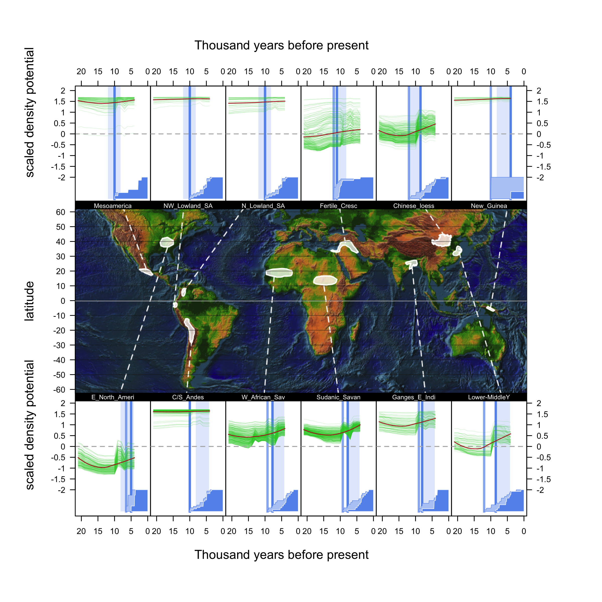
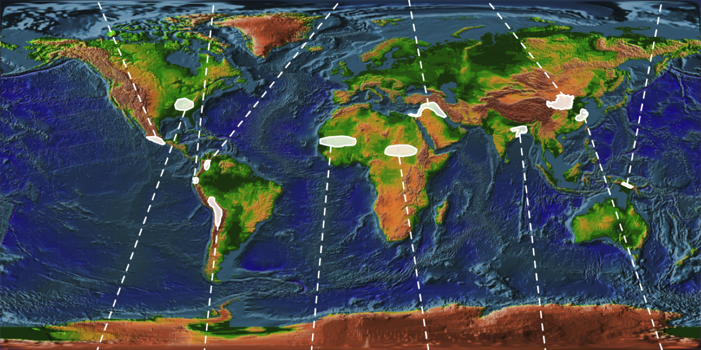

## Current best version



## Code
1. [R environment setup](#r-environment-setup)
2. [Setting time breaks](#setting-time-breaks)
3. [Defining origins](#defining-origins)
4. [Map for final figure](#map-for-final-figure)
5. [Import raster data](#import-raster-data)
6. [GAM vs. Loess smoothing models](#gam-vs-loess-smoothing-models)
7. [Compare rates between origins and not-origins](#compare-rates-between-origins-and-not-origins)
8. [Compare rates between different time periods](#compare-rates-between-different-time-periods)
9. [Setup final figure](#setup-final-figure)
10. [Trend through time panel for final figure](#trend-through-time-panel)
11. [Assemble and print final figure](#assemble-the-figure)


## R environment setup
#### Attach libraries
```{r}
library(png)
library(maptools)
library(raster)
library(gam)
library(maps)
library(mapproj)
library(rgl)
library(knitr) 
```


#### Set working directory
```{r}
setwd("~/Desktop/Botero postdoc 2016/Human density and the origins of agriculture/")
```


## Setting time breaks
#### Define the times of agricultural origins


```{r}
par(mar=c(0,0,0,20))
d <- readPNG("Larson_dates.png")
plot(seq(0,18, length.out = 19), seq(0,36, length.out = 19), type="n",ylim=c(0,36),xlim=c(0, 18), xaxt="n")

rasterImage(d, 0,0,18,36, interpolate=TRUE, col=d)


Start_of_early_window <- 16-12
End_of_early_window_start_of_late_window <- 8.2
End_of_late_window <- 17-4.2

polygon(x=c(Start_of_early_window, Start_of_early_window, End_of_early_window_start_of_late_window, End_of_early_window_start_of_late_window), y=c(0, 34, 34, 0), col=adjustcolor("limegreen", alpha= 0.2), border=adjustcolor("limegreen", alpha= 0.9))

polygon(x=c( End_of_early_window_start_of_late_window, End_of_early_window_start_of_late_window, End_of_late_window, End_of_late_window), y=c(0, 34, 34, 0), col=adjustcolor("firebrick", alpha= 0.2), border=adjustcolor("firebrick", alpha= 0.9))

```


These dates are provided in the supplimentary information for the Larson (2014) paper. I've copied those values into a .csv table provided here. 

```{r}
domestication_times <- read.csv("Domestication timing larson 2014.csv")

dim(domestication_times)
```

```{r, echo=FALSE}

kable(domestication_times, caption= "This is our world")
```


```{r}
par(mar=c(5,4,6,1))

dates <- unlist(domestication_times[3:8])
hist(dates, breaks = 22, xlim=c(15,0), xlab="K years ago", col=adjustcolor("cornflowerblue", alpha= 0.5), border=adjustcolor("cornflowerblue", alpha= 0.9), main="All dates in dataset"  )
mtext("This tells us about how evenly our evidence is distributed in time", 3, line=1)


```

```{r}
hist(dates, breaks = 22, xlim=c(15,0), xlab="Thousand years ago", col=adjustcolor("cornflowerblue", alpha= 0.5), border=adjustcolor("cornflowerblue", alpha= 0.9), main="All dates in dataset with Larson(2014) date windows")

Start_of_early_window <- 12
End_of_early_window_start_of_late_window <- 8.2
End_of_late_window <- 4.2

polygon(x=c(Start_of_early_window, Start_of_early_window, End_of_early_window_start_of_late_window, End_of_early_window_start_of_late_window), y=c(0, 30, 30, 0), col=adjustcolor("limegreen", alpha= 0.2), border=adjustcolor("limegreen", alpha= 0.9))

polygon(x=c( End_of_early_window_start_of_late_window, End_of_early_window_start_of_late_window, End_of_late_window, End_of_late_window), y=c(0, 30, 30, 0), col=adjustcolor("firebrick", alpha= 0.2), border=adjustcolor("firebrick", alpha= 0.9))

hist(dates, breaks = 22, xlim=c(15,0), xlab="K years ago", col=adjustcolor("cornflowerblue", alpha= 0.2), border=adjustcolor("cornflowerblue", alpha= 0.9), main="", add=TRUE)

mtext("Early Holocene", 3, line = -1, adj=.3)
mtext("Middle Holocene", 3, line= -1, adj=.6)

```

```{r}

par(mfrow=c(2,3), mar=c(4,4,2,0))
dim(domestication_times)
specific_dates <- domestication_times[,3:8]

for(i in c(1, 3, 5, 2, 4, 6)){
hist(specific_dates[,i], breaks = 22, xlim=c(15,0), xlab="Thousand years ago", col=adjustcolor("cornflowerblue", alpha= 0.5), border=adjustcolor("cornflowerblue", alpha= 0.9), main= names(specific_dates)[i])

Start_of_early_window <- 12
End_of_early_window_start_of_late_window <- 8.2
End_of_late_window <- 4.2

polygon(x=c(Start_of_early_window, Start_of_early_window, End_of_early_window_start_of_late_window, End_of_early_window_start_of_late_window), y=c(0, 30, 30, 0), col=adjustcolor("limegreen", alpha= 0.2), border=adjustcolor("limegreen", alpha= 0.9))

polygon(x=c( End_of_early_window_start_of_late_window, End_of_early_window_start_of_late_window, End_of_late_window, End_of_late_window), y=c(0, 30, 30, 0), col=adjustcolor("firebrick", alpha= 0.2), border=adjustcolor("firebrick", alpha= 0.9))

hist(specific_dates[,i], breaks = 22, xlim=c(15,0), xlab="K years ago", col=adjustcolor("cornflowerblue", alpha= 0.2), border=adjustcolor("cornflowerblue", alpha= 0.9), main="", add=TRUE)
}
```


I'm creating new rows for this table, combining dates in different ways to make the CDFs below look more authentic. This makes it so that pre-ag always happens before post-ag. What I've done is given the later date to the earlier date when those dates are missing. 
```{r}
h <- which(is.na(domestication_times[,3]))
domestication_times <- cbind(domestication_times, rep(NA, length(domestication_times[,1])))
domestication_times[,9] <- domestication_times[,3]
domestication_times[h,9] <- domestication_times[h,7]
colnames(domestication_times)[9] <- "adopt exploitation date"
domestication_times[,10] <- domestication_times[,7]
domestication_times[which(is.na(domestication_times[,10])),10] <- 0
colnames(domestication_times)[10] <- "start of ag"
#save(domestication_times, file="~/Desktop/Human density and the origins of agriculture/Domestication timing larson 2014.Rdata")
```


I think these are best described by a cummulative distribution, showing how they accumulate over time. 

```{r}
for(i in 1:8){
type_number <- i
	match <- domestication_times[ which(domestication_times$Region == levels(domestication_times$Region)[ type_number]), 9]
	maxer <- max(match, na.rm=TRUE)
	j <- ecdf(maxer-match)
	print(levels(domestication_times$Region)[ type_number])
	print(match)
	print(j)
}
```


```{r}
par(mfcol=c(2,5), mar=c(4,0,5,0))

plot(0,0, type="n", xaxt="n", xlab="", bty="n")
mtext("Percent of species that will eventually \n be domesticated in a region", 2, line=-5, cex=0.5)
plot(0,0, type="n", xaxt="n", xlab="", bty="n")
mtext("Percent of species that will eventually \n be domesticated in a region", 2, line=-5, cex=0.5)

for(i in 1:8){
type_number <- i
	match <- domestication_times[ which(domestication_times$Region == levels(domestication_times$Region)[ type_number]), 9]
	maxer <- max(match, na.rm=TRUE)
	j <- ecdf(maxer-match)
	#print(j)
	
plot(0,0, xlim=c(15,0), ylim=c(0,100), ylab="Percent of species that will eventually \n be domesticated in a region", xlab="Thousand years ago", main=levels(domestication_times$Region)[ type_number], type="n", yaxt="n")

x_seq <- rev(c(0,seq(0, maxer, length.out=100)))
y_seq <- 100 * (c(0, j(seq(0, maxer, length.out=100))))

lines(x_seq, y_seq,  ylim=c(-1,1))
polygon(c(0, x_seq), c(0, y_seq), border=adjustcolor("cornflowerblue",alpha=1), col=adjustcolor("cornflowerblue", alpha=0.2))
if(i == 2 | i == 1)axis(2)

if(i == 3)mtext("Cummulative distribution function for the accumulation of domesticates", 3, line=3.8, col="cornflowerblue")
}


```


```{r}
par(mfcol=c(2,5), mar=c(4,0,5,0))

plot(0,0, type="n", xaxt="n", xlab="", bty="n")
mtext("Percent of species that will eventually \n be domesticated in a region", 2, line=-5, cex=0.5)

plot(0,0, type="n", xaxt="n", xlab="", bty="n")
mtext("Percent of species that will eventually \n be domesticated in a region", 2, line=-5, cex=0.5)

for(i in 1:8){
type_number <- i
	match <- domestication_times[ which(domestication_times$Region == levels(domestication_times$Region)[ type_number]), 9]
	maxer <- max(match, na.rm=TRUE)
	j <- ecdf(maxer-match)
	#print(j)
	
plot(0,0, xlim=c(15,0), ylim=c(0,100), ylab="Percent of species that will eventually \n be domesticated in a region", xlab="Thousand years ago", main=levels(domestication_times$Region)[ type_number], type="n", yaxt="n")

x_seq <- rev(c(0,seq(0, maxer, length.out=100)))
y_seq <- 100 * (c(0, j(seq(0, maxer, length.out=100))))

lines(x_seq, y_seq,  ylim=c(-1,1))
polygon(c(0, x_seq), c(0, y_seq), border=adjustcolor("cornflowerblue",alpha=1), col=adjustcolor("cornflowerblue", alpha=0.2))
abline(v= maxer - quantile(j)[2], col="limegreen", lwd=2)
if(i == 2 | i == 1)axis(2)
if(i == 2)mtext("25%", 3, line=3.5, adj=-1, col="limegreen")
if(i == 3)mtext("Cummulative distribution function for the accumulation of domesticates", 3, line=3.8, col="cornflowerblue")
if(i == 4)mtext("Choose a y to predict an x", 3, line=3.3, col="cornflowerblue")
	break_one <- maxer
			break_two <- maxer - quantile(j)[2]
				
	polygon(x=c(break_two, break_two, break_one, break_one), y=c(0, 1, 1, 0), col=adjustcolor("cornflowerblue", alpha=0.2), border=adjustcolor("cornflowerblue",alpha=1))
			lines(x=c(break_two, break_two), y=c(0,-1), col="cornflowerblue")
			abline(h = 25, col="limegreen", lwd=2)
}


```
Make this a function. 
There is a choice of two methods here. At the end of this section we need to print the desision we're passing to the later analyses. 


## Defining origins


```{r}
origins <- readShapePoly('Origins_updated.shp')
proj4string(origins) <- CRS("+proj=longlat +datum=WGS84")
#proj <- CRS("+proj=eqc +lat_ts=0 +lat_0=0 +lon_0=0 +x_0=0 +y_0=0 +ellps=WGS84 +units=m +no_defs")
#origins.ea <- spTransform(origins, proj)


#subset_order <- c(1, 2, 3, 5, 6, 8, 9, 10, 11, 12, 17, 18)
subset_order <- c(8, 10, 9, 5, 18, 7, 6, 20, 1, 2, 13, 14)
origins_subset <- origins[subset_order,]
origins_subset$CONTINENT
origins_subset$name


```

```{r}

map()
map(origins, add=TRUE, fill=TRUE, col=adjustcolor("cornflowerblue", alpha=1))

```

 

##map for final figure


#### Make the map for the center panel (#5 on layout panel)

```{r}
d <- readPNG("earth.png")
```


```{r}
png(file=paste("40961.png",sep=""),width=1440,height=720, bg="transparent")
par(mar=c(0,0,0,0), mai=c(0,0,0,0))
plot(seq(-180, 180, length.out = 19), seq(-90, 90, length.out = 19), type="n",xlim=c(-180, 180),ylim=c(-90, 90), xaxt="n")
x_adj <- 0
y_adj <- 0
rasterImage(d, -180 - x_adj, -90 - y_adj, 180 + x_adj, 90 + y_adj, interpolate=TRUE, col=d)

#polygon(x=c(-180,-180, 180,180), y=c(-90, 90, 90, -90), col=adjustcolor("white", alpha=0.1))
#rasterImage(d, -13.5, -13.5, 375, 375, interpolate=TRUE, col=d)
plot(origins_subset, add=TRUE, col=adjustcolor("white", alpha=.8), xaxt="n", border="white", lwd=4) #still need to reproject!!!
LW <- 4
lines(x = c(-100 , -130), y = c(20 , 90), lty=2, col=adjustcolor("white", alpha=1), lwd=LW) #Mesoamerica
lines(x = c(-80 , -70), y = c(0 , 90), lty=2, col=adjustcolor("white", alpha=1), lwd=LW) #NW_Lowland_SA
lines(x = c(-74 , -5 ), y = c(5 , 90), lty=2, col=adjustcolor("white", alpha=1), lwd=LW) #N_Lowland_SA
lines(x = c(40 , 30), y = c(36 , 90), lty=2, col=adjustcolor("white", alpha=1), lwd=LW) #Fertile_Cresc
lines(x = c(110 , 70), y = c(40 , 90), lty=2, col=adjustcolor("white", alpha=1), lwd=LW) #Chinese_loess
lines(x = c(142 , 160), y = c(-5 , 90), lty=2, col=adjustcolor("white", alpha=1), lwd=LW) #New_Guinea
lines(x = c(-85 , -130), y = c(33 , -90), lty=2, col=adjustcolor("white", alpha=1), lwd=LW) #E_North_Ameri
lines(x = c(-68 , -75), y = c(-25 , -90), lty=2, col=adjustcolor("white", alpha=1), lwd=LW) #C/S_Andes
lines(x = c(-10 , -20), y = c( 15, -90), lty=2, col=adjustcolor("white", alpha=1), lwd=LW) #W_African_Sav
lines(x = c(25 , 40), y = c(9 , -90), lty=2, col=adjustcolor("white", alpha=1), lwd=LW) #Sudanic_Savan
lines(x = c(87 , 100), y = c(20 , -90), lty=2, col=adjustcolor("white", alpha=1), lwd=LW) #Ganges_E_Indi
lines(x = c(120 , 160), y = c(30 , -90), lty=2, col=adjustcolor("white", alpha=1), lwd=LW) #Lower-MiddleY


dev.off()
```

```{r}
#need to overplot so it fills the whole frame. the default plot leaves a border around the photo
d <- readPNG("40961.png")
png(file=paste("40962.png",sep=""),width=1440,height=720, bg="transparent")
par(mar=c(0,0,0,0), mai=c(0,0,0,0))
plot(seq(-180, 180, length.out = 19), seq(-90, 90, length.out = 19), type="n",xlim=c(-180, 180),ylim=c(-90, 90), xaxt="n")
x_adj <- 30
y_adj <- 15
rasterImage(d, -180 - x_adj, -90 - y_adj, 180 + x_adj, 90 + y_adj, interpolate=TRUE, col=d)

dev.off()
```





##Import raster data 

unit = potential human density and projected productivity
```{r}
#subset and reorder origins. This is currently done at the end of the plot but should be moved forward.

# Load data for population density
load("PopD_all_December.rdata")
PopD.ALL
```

```{r}
# Extract data to a matrix
Pop <- values(PopD.ALL)
r <- raster(PopD.ALL, 1)
r
```


##GAM vs Loess smoothing models
### Justification for smoothing Models.
  We need to justify our decision to use a GAM over other models. This should include citations to back up those arguments.
  
  This is a data fitting model, not a theory driven model. There is no process or mechanism built into the model, the model is just flexably fitting the data. There are many ways of doing this, but here we're competing the GAM and Loess against eachother to tell us a better story. The models are very similar, but slightly different. The Loess model is a local averaging model where the flexible parameter is how many of the surrounding points to take into consideration, and the GAM is a global averaging model where the flexible parameter is the number of bends in the line and then those bends are fit in the best way possible. The advantage of GAM is that it produces a translatable model that could be fit to different datasets. The disadvantage of GAM is that it often produces poor data fits. The Loess model moves along the x-axes and averages along the way. The advantage of a loess is that it tends to track the data nicely with few parameters, but it doesn't produce a transportable model for comparing against other datasets. 
  
#### about LOESS from the internet: http://www.itl.nist.gov/div898/handbook/pmd/section1/pmd144.htm

"LOESS, originally proposed by Cleveland (1979) and further developed by Cleveland and Devlin (1988), specifically denotes a method that is (somewhat) more descriptively known as locally weighted polynomial regression. At each point in the data set a low-degree polynomial is fit to a subset of the data, with explanatory variable values near the point whose response is being estimated. The polynomial is fit using weighted least squares, giving more weight to points near the point whose response is being estimated and less weight to points further away. The value of the regression function for the point is then obtained by evaluating the local polynomial using the explanatory variable values for that data point. The LOESS fit is complete after regression function values have been computed for each of the n data points. Many of the details of this method, such as the degree of the polynomial model and the weights, are flexible. 
  The local polynomials fit to each subset of the data are almost always of first or second degree; that is, either locally linear (in the straight line sense) or locally quadratic. Using a zero degree polynomial turns LOESS into a weighted moving average. Such a simple local model might work well for some situations, but may not always approximate the underlying function well enough. Higher-degree polynomials would work in theory, but yield models that are not really in the spirit of LOESS. LOESS is based on the ideas that any function can be well approximated in a small neighborhood by a low-order polynomial and that simple models can be fit to data easily. High-degree polynomials would tend to overfit the data in each subset and are numerically unstable, making accurate computations difficult.
  The biggest advantage LOESS has over many other methods is the fact that it does not require the specification of a function to fit a model to all of the data in the sample. Instead the analyst only has to provide a smoothing parameter value and the degree of the local polynomial. In addition, LOESS is very flexible, making it ideal for modeling complex processes for which no theoretical models exist. These two advantages, combined with the simplicity of the method, make LOESS one of the most attractive of the modern regression methods for applications that fit the general framework of least squares regression but which have a complex deterministic structure.
  Although LOESS does share many of the best features of other least squares methods, efficient use of data is one advantage that LOESS doesn't share. LOESS requires fairly large, densely sampled data sets in order to produce good models. This is not really surprising, however, since LOESS needs good empirical information on the local structure of the process in order perform the local fitting. In fact, given the results it provides, LOESS could arguably be more efficient overall than other methods like nonlinear least squares. It may simply frontload the costs of an experiment in data collection but then reduce analysis costs.
Another disadvantage of LOESS is the fact that it does not produce a regression function that is easily represented by a mathematical formula. This can make it difficult to transfer the results of an analysis to other people. In order to transfer the regression function to another person, they would need the data set and software for LOESS calculations. In nonlinear regression, on the other hand, it is only necessary to write down a functional form in order to provide estimates of the unknown parameters and the estimated uncertainty. Depending on the application, this could be either a major or a minor drawback to using LOESS.
Finally, as discussed above, LOESS is a computational intensive method. This is not usually a problem in our current computing environment, however, unless the data sets being used are very large. LOESS is also prone to the effects of outliers in the data set, like other least squares methods. There is an iterative, robust version of LOESS [Cleveland (1979)] that can be used to reduce LOESS' sensitivity to outliers, but extreme outliers can still overcome even the robust method.
	$q$ is called the smoothing parameter because it controls the flexibility of the LOESS regression function. Large values of q produce the smoothest functions that wiggle the least in response to fluctuations in the data. The smaller $q$ is, the closer the regression function will conform to the data. Using too small a value of the smoothing parameter is not desirable, however, since the regression function will eventually start to capture the random error in the data. Useful values of the smoothing parameter typically lie in the range $0.25$ to $0.5$ for most LOESS applications."
  
#### about GAM from the internet: http://multithreaded.stitchfix.com/blog/2015/07/30/gam/
  
  "Imagine that you step into a room of data scientists; the dress code is casual and the scent of strong coffee is hanging in the air. You ask the data scientists if they regularly use generalized additive models (GAM) to do their work. Very few will say yes, if any at all.

Now let’s replay the scenario, only this time we replace GAM with, say, random forest or support vector machines (SVM). Everyone will say yes, and you might even spark a passionate debate.

Despite its lack of popularity in the data science community, GAM is a powerful and yet simple technique. Hence, the purpose of this post is to convince more data scientists to use GAM. Of course, GAM is no silver bullet, but it is a technique you should add to your arsenal. Here are three key reasons:

Easy to interpret.

Flexible predictor functions can uncover hidden patterns in the data.

Regularization of predictor functions helps avoid overfitting.

  In general, GAM has the interpretability advantages of GLMs where the contribution of each independent variable to the prediction is clearly encoded. However, it has substantially more flexibility because the relationships between independent and dependent variable are not assumed to be linear. In fact, we don’t have to know a priori what type of predictive functions we will eventually need. From an estimation standpoint, the use of regularized, nonparametric functions avoids the pitfalls of dealing with higher order polynomial terms in linear models. From an accuracy standpoint, GAMs are competitive with popular learning techniques.

Generalized additive models were originally invented by Trevor Hastie and Robert Tibshirani in 1986 (see [1], [2]). The GAM framework is based on an appealing and simple mental model:

    Relationships between the individual predictors and the dependent variable follow smooth patterns that can be linear or nonlinear.

    We can estimate these smooth relationships simultaneously and then predict $$g(E(Y)))$$
 by simply adding them up.

Mathematically speaking, GAM is an additive modeling technique where the impact of the predictive variables is captured through smooth functions which—depending on the underlying patterns in the data—can be nonlinear.

References

[1] Hastie, Trevor and Tibshirani, Robert. (1990), Generalized Additive Models, New York: Chapman and Hall.

[2] Hastie, Trevor and Tibshirani, Robert. (1986), Generalized Additive Models, Statistical Science, Vol. 1, No 3, 297-318.

[3] Wood, S. N. (2006), Generalized Additive Models: an introduction with R, Boca Raton: Chapman & Hall/CRC

[4] Wood, S. N. (2004). Stable and efficient multiple smoothing parameter estimation for generalized additive models. Journal of the American Statistical Association 99, 673–686

[5] Marx, Brian D and Eilers, Paul H.C. (1998). Direct generalized additive modeling with penalized likelihood, Computational Statistics & Data Analysis 28 (1998) 193-20

[6] Sinha, Samiran, A very short note on B-splines, http://www.stat.tamu.edu/~sinha/research/note1.[PDF](/assets/files/gam.pdf)

[7] German Rodrıguez (2001), Smoothing and Non-Parametric Regression, http://data.princeton.edu/eco572/smoothing.pd

[8] Notes on GAM By Simon Wood. http://people.bath.ac.uk/sw283/mgcv/tampere/gam.[PDF](/assets/files/gam.pdf)

[9] Notes on Smoothing Parameter Selection By Simon Wood, http://people.bath.ac.uk/sw283/mgcv/tampere/smoothness.[PDF](/assets/files/gam.pdf)

[10] Notes on REML & GAM By Simon Wood, http://people.bath.ac.uk/sw283/talks/REML.[PDF](/assets/files/gam.pdf)

[11] Karatzoglou, Alexandros, Meyer, David and Hornik, Kurt (2006), Support Vector Machines in R, Journal of Statistical Software Volume 15, Issue 9, http://www.jstatsoft.org/v15/i09/paper

[12] “e1071” package, https://cran.r-project.org/web/packages/e1071/e1071.[PDF](/assets/files/gam.pdf)

[13] “mgcv” package, https://cran.r-project.org/web/packages/mgcv/mgcv.[PDF](/assets/files/gam.pdf)

[14] “gam” package, https://cran.r-project.org/web/packages/gam/gam.[PDF](/assets/files/gam.pdf)

[15] “randomForestSRC” package, https://cran.r-project.org/web/packages/randomForestSRC/randomForestSRC.[PDF](/assets/files/gam.pdf)

or from: http://plantecology.syr.edu/fridley/bio793/gam.html

GAMs in R are a nonparametric extension of GLMs, used often for the case when you have no a priori reason for choosing a particular response function (such as linear, quadratic, etc.) and want the data to 'speak for themselves'.  GAMs do this via a smoothing function, similar to what you may already know about locally weighted regressions.  GAMs take each predictor variable in the model and separate it into sections (delimited by 'knots'), and then fit polynomial functions to each section separately, with the constraint that there are no kinks at the knots (second derivatives of the separate functions are equal at the knots).  The number of parameters used for such fitting is obviously more than what would be necessary for a simpler parametric fit to the same data, but computational shortcuts mean the model degrees of freedom is usually lower than what you might expect from a line with so much 'wiggliness'.  Indeed this is the principal statistical issue associated with GAM modeling: minimizing residual deviance (goodness of fit) while maximizing parsimony (lowest possible degrees of freedom).  Since the model fit is based on deviance/likelihood, fitted models are directly comparable with GLMs using likelihood techniques (like AIC) or classical tests based on model deviance (Chi-squared or F tests, depending on the error structure).  Even better, all the error and link structures of GLMs are available in GAMs (including poisson and binomial), as are the standard suite of lm or glm attributes (resid, fitted, summary, coef, etc.).  A principal reason why GAMs are often less preferred than GLMs is that the results are often difficult to interpret because no parameter values are returned (although significance tests of each term are).  They can be very good for prediction/interpolation, as well as exploratory analyses about the functional nature of a response.  Some researchers examine the shape of a curve with GAMs, then reconstruct the curve shape parametrically with GLMs for model building.
            There are two common implementations of GAMs in R.  The older version (originally made for S-PLUS) is available as the 'gam' package by Hastie and Tibshirani.  The newer version that we will use below is the 'mgcv' package from Simon Wood.  The basic modeling procedure for both packages is similar (the function is gam for both; be wary of having both libraries loaded at the same time), but the behind-the-scenes computational approaches differ, as do the arguments for optimization and the model output.  Expect the results to be slightly different when used with the same model structure on the same dataset."
  
  
  
  These are the most uninformed models you can use. We can certainly try to add some process to these models and try to get some more reliable numbers, but this will involve more work. 


### Fit and plot GAM model with different degrees of freedom
We should make our decisions very transparent here. We should be able to justify our decision of 3 degrees of freedom over other possible values. 

#### Density projections

```{r, cache=TRUE}
# Read the polygons
library(rgdal)
getwd()
origins <- readShapePoly('Origins_updated.shp')
proj4string(origins) 

```


```{r}
# Extract data
library(raster)
e <- extent(-180, 180, -60, 84)
all_cells <- extract(r, e, cellnumber = TRUE)

per.origin <- extract(r, origins, cellnumber = TRUE, buffer = 100000)

length(all_cells)
for(i in 1:20){
all_cells <- all_cells[-which(per.origin[[i]][,1] %in% all_cells[,1]), ]
}
length(all_cells)

names(per.origin) <- origins@data[, 1]

str(all_cells)
str(per.origin)
```

```{r}
origin_vectors <- rep(NA, 3)

for(h in 1:20){
originI <- Pop[per.origin[[h]][, 1], ]
cell_vector <-  as.vector(per.origin[[h]][, 1])
x_values <- matrix(c(4:21), dim(originI)[1], 18, byrow=TRUE)
x_value_vector <- as.vector(x_values)
y_value_vector <- as.vector(originI)

all_vectors_pre <- cbind(rep(names(per.origin)[h], length(x_value_vector)),x_value_vector, y_value_vector, cell_vector)
origin_vectors <- rbind(origin_vectors, all_vectors_pre)
}

#names(origin_vectors)[1] <- "location"
origin_vectors <- origin_vectors[-1,]
head(origin_vectors)
```

```{r}
#not in origin

All <- Pop[all_cells[, 1], ]
cell_vector <-  as.vector(All[, 1])
x_values <- matrix(c(4:21), dim(All)[1], 18, byrow=TRUE)
x_value_vector <- as.vector(x_values)
y_value_vector <- as.vector(All)

all_vectors_pre <- cbind(rep("not_origin", length(x_value_vector)),x_value_vector, y_value_vector, cell_vector)
all_vectors <- as.data.frame(rbind(origin_vectors, all_vectors_pre))
levels(all_vectors[,1])
```

```{r}

all_vectors <- cbind(all_vectors, scale(as.numeric(all_vectors[,3])))
colnames(all_vectors) <- c("location_name", "x_values", "density_values", "cell_ID", "scaled_density_values")
all_vectors <- all_vectors[, c(1,2,3,5,4)]
dim(all_vectors)
```


```{r, cache=TRUE}

origins <- subset(all_vectors, location_name != "not_origin")

par(mfrow=c(4,6), mar=c(0,0,0,0), xaxt="n")
for(h in 1:20){
#h <- 3
density_trend <- origins[which(origins[,1] == names(per.origin)[h]),]

plot(as.numeric(density_trend[,2]), as.numeric(density_trend[,4]), col=adjustcolor("cornflowerblue", alpha=0.8),  xlab="year", ylab="Density", ylim=c(-5,5), xlim=c(4,21), type="n")

points(as.numeric(density_trend[,2]), as.numeric(density_trend[,4]), cex=0.5, col=adjustcolor("cornflowerblue", 0.5))
mtext(as.character(density_trend[1,1]), 3, line=-1, cex=0.5)
}

#all origins
plot(as.numeric(density_trend[,2]), as.numeric(density_trend[,4]), col=adjustcolor("cornflowerblue", alpha=0.8),  xlab="year", ylab="Density", ylim=c(-5,5), xlim=c(4,21), type="n")

points(as.numeric(origins[,2]), as.numeric(origins[,4]), cex=0.5, col=adjustcolor("cornflowerblue", 0.5))
mtext("all origins", 3, line=-1, cex=0.5)

#not origins
not_origins <- subset(all_vectors, location_name == "not_origin")
plot(as.numeric(not_origins[,2]), as.numeric(not_origins[,4]), col=adjustcolor("cornflowerblue", alpha=0.8),  xlab="year", ylab="Density", ylim=c(-5,5), xlim=c(4,21), type="n")

points(as.numeric(not_origins[,2]), as.numeric(not_origins[,4]), cex=0.5, col=adjustcolor("cornflowerblue", 0.5))
mtext("everything other than origins", 3, line=-1, cex=0.5)
```


```{r, cache=TRUE}

par(mfrow=c(4,6), mar=c(0,0,0,0), xaxt="n")
for(h in 1:20){
#h <- 3
density_trend <- origins[which(origins[,1] == names(per.origin)[h]),]

plot(as.numeric(density_trend[,2]), as.numeric(density_trend[,4]), col=adjustcolor("cornflowerblue", alpha=0.8),  xlab="year", ylab="Density", ylim=c(-2,2), xlim=c(4,21), type="n")

for(g in levels(as.factor(density_trend[,5]))){
subbed <- subset(density_trend, cell_ID == g)
ordered_subbed <- subbed[order(subbed$x_values), ]
lines(as.numeric(ordered_subbed[,2]), as.numeric(ordered_subbed[,4]), lwd=.3, col=adjustcolor("cornflowerblue", 0.8))
}
mtext(as.character(density_trend[1,1]), 3, line=-1, cex=0.5)
}

#all origins
plot(as.numeric(density_trend[,2]), as.numeric(density_trend[,4]), col=adjustcolor("cornflowerblue", alpha=0.8),  xlab="year", ylab="Density", ylim=c(-2,2), xlim=c(4,21), type="n")

for(g in levels(as.factor(density_trend[,5]))){
subbed <- subset(density_trend, cell_ID == g)
ordered_subbed <- subbed[order(subbed$x_values), ]
lines(as.numeric(ordered_subbed[,2]), as.numeric(ordered_subbed[,4]), lwd=.3, col=adjustcolor("cornflowerblue", 0.8))
}
mtext("all origins", 3, line=-1, cex=0.5)


```


```{r, cache=TRUE}
par(mfrow=c(4,6), mar=c(0,0,0,0))
for(h in 1:20){
#h <- 3
density_trend <- all_vectors[which(all_vectors[,1] == names(per.origin)[h]),]

plot(as.numeric(density_trend[,2]), as.numeric(density_trend[,4]), col=adjustcolor("cornflowerblue", alpha=0.8),  xlab="year", ylab="Density", ylim=c(-3,3), xlim=c(4,21), type="n", xaxt="n", yaxt="n")

points(as.numeric(density_trend[,2]), as.numeric(density_trend[,4]), cex=0.5, col=adjustcolor("grey", 0.5))


ordered_density_trend <- density_trend[order(density_trend$x_values), ]


gammer <- loess(as.numeric(ordered_density_trend[,4]) ~ as.numeric(ordered_density_trend[,2]))
summary(gammer)


lines(as.numeric(ordered_density_trend[,2]) ,predict(gammer),  col="cornflowerblue", lwd=2)
mtext(as.character(ordered_density_trend[1,1]), 3, line=-1, cex=0.5)
}

density_trend <- all_vectors[-1,]

plot(as.numeric(density_trend[,2]), as.numeric(density_trend[,4]), col=adjustcolor("cornflowerblue", alpha=0.8),  xlab="year", ylab="Density", ylim=c(-3,3), xlim=c(4,21), type="n", xaxt="n", yaxt="n")

points(as.numeric(density_trend[,2]), as.numeric(density_trend[,4]), cex=0.5, col=adjustcolor("grey", 0.5))


ordered_density_trend <- density_trend[order(density_trend$x_values), ]


gammer <- loess(as.numeric(ordered_density_trend[,4]) ~ as.numeric(ordered_density_trend[,2]))
summary(gammer)


length(ordered_density_trend[,2])
length(predict(gammer))

lines(as.numeric(ordered_density_trend[,2]) ,predict(gammer),  col="cornflowerblue", lwd=2)
mtext("all origins", 3, line=-1, cex=0.5)

```

span	
the parameter α which controls the degree of smoothing.

The size of the neighbourhood is controlled by α (set by span or enp.target). For α < 1, the neighbourhood includes proportion α of the points, and these have tricubic weighting (proportional to (1 - (dist/maxdist)^3)^3). For α > 1, all points are used, with the ‘maximum distance’ assumed to be α^(1/p) times the actual maximum distance for p explanatory variables.

```{r, cache=TRUE}
par(mfrow=c(4,6), mar=c(0,0,0,0))
for(h in 1:20){
#h <- 3
density_trend <- all_vectors[which(all_vectors[,1] == names(per.origin)[h]),]
ordered_density_trend <- density_trend[order(density_trend$x_values), ]

gammer <- loess(as.numeric(ordered_density_trend[,4]) ~ as.numeric(ordered_density_trend[,2]), span = .5)
summary(gammer)
predict_gam <- predict(gammer, se=TRUE)

plot(as.numeric(density_trend[,2]), as.numeric(density_trend[,4]), col=adjustcolor("cornflowerblue", alpha=0.8),  xlab="year", ylab="Density", ylim=c(-2,2), xlim=c(0,21), type="n", xaxt="n", yaxt="n")
#axis(1, label= seq(4,21, by=1), at=rev(seq(1,18, by=1)))

polygon(x=22-c(Start_of_early_window, Start_of_early_window, End_of_early_window_start_of_late_window, End_of_early_window_start_of_late_window), y=c(-2, 2, 2, -2), col=adjustcolor("limegreen", alpha= 0.2), border=adjustcolor("limegreen", alpha= 0.9))

polygon(x=22-c( End_of_early_window_start_of_late_window, End_of_early_window_start_of_late_window, End_of_late_window, End_of_late_window), y=c(-2, 2, 2, -2), col=adjustcolor("firebrick", alpha= 0.2), border=adjustcolor("firebrick", alpha= 0.9))

abline(h=0, lty=2, col="grey")

lines(ordered_density_trend[,2] ,predict_gam$fit,  col="cornflowerblue")
lines(ordered_density_trend[,2] ,  predict_gam$fit + predict_gam$se.fit,  col="grey", lty=1)
lines(ordered_density_trend[,2] ,  predict_gam$fit - predict_gam$se.fit,  col="grey", lty=1)


mtext(as.character(ordered_density_trend[1,1]), 3, line=-1, cex=0.5)
}

```


```{r, cache=TRUE}
par(mfrow=c(2,5), mar=c(0,0,0,0))
for(j in seq(0.2, 2, by=.2)){

plot(as.numeric(density_trend[,2]), as.numeric(density_trend[,4]), col=adjustcolor("cornflowerblue", alpha=0.8),  xlab="year", ylab="Density", ylim=c(-3,3), xlim=c(0,21), type="n", xaxt="n")
axis(1, label= seq(4,21, by=1), at=rev(seq(1,18, by=1)))


polygon(x=22-c(Start_of_early_window, Start_of_early_window, End_of_early_window_start_of_late_window, End_of_early_window_start_of_late_window), y=c(-2, 2, 2, -2), col=adjustcolor("limegreen", alpha= 0.2), border=adjustcolor("limegreen", alpha= 0.9))

polygon(x=22-c( End_of_early_window_start_of_late_window, End_of_early_window_start_of_late_window, End_of_late_window, End_of_late_window), y=c(-2, 2, 2, -2), col=adjustcolor("firebrick", alpha= 0.2), border=adjustcolor("firebrick", alpha= 0.9))


for(h in 1:18){
#h <- 3
density_trend <- all_vectors[which(all_vectors[,1] == levels(all_vectors[,1])[h]),]
ordered_density_trend <- density_trend[order(density_trend$x_values), ]

gammer <- loess(as.numeric(ordered_density_trend[,4]) ~ as.numeric(ordered_density_trend[,2]), span = j)
summary(gammer)
predict_gam <- predict(gammer, se=TRUE)

abline(h=0, lty=2, col="grey")

lines(ordered_density_trend[,2] ,predict_gam$fit,  col="cornflowerblue")

}
mtext(paste("span = ", j), 3, line=-3, cex=0.5)
}
```


```{r, cache=TRUE}
# need to add a global mean, an everything but the origins mean, and a buffer around the origins mean. 
# Function standardization
std <- function(x) {
  b <- (x - min(x)) / (max(x) - min(x))
  return(rev(b))
}


diff_df <- function(h){ 
# Calculating mean and 
global.means <- global.SD <- list()

for (j in 1:length(per.origin)) {
  #print(j)
  originI <- Pop[per.origin[[j]][, 1], ]
  time <- 21:4
  originI <- na.exclude(originI)
  b <- apply(originI, 1, std)
  nJ <- nrow(originI)
  predictions <- matrix(nrow = nJ, ncol = length(time))
  colnames(predictions) <- as.character(time)
  for(i in 1:nJ) {
    
    # Need to show a gradient of these df values. 
    model <- gam(b[, i] ~ s(time, df = h))
    col <- sample(rainbow(100), 1)
    predictions[i, ] <- predict(model)
    #plot(b[, i] ~ time)
    #lines(predictions[i, ] ~ time)
  }
  global.means[[j]] <- apply(predictions, 2, mean) 
  global.SD[[j]] <- apply(predictions, 2, sd)
}


names(global.means) <- names(per.origin)
names(global.SD) <- names(per.origin)

return(list(global.means, global.SD))
}


```


```{r}
means_matrix <- matrix(rep(NA,19*20), 20, 19)
colnames(means_matrix) <- c("origin", rev(seq(4, 21, by=1)))
means_matrix[,1] <- names(global.means)
for(i in 1:20){
means_matrix[i,2:19] <- global.means[[i]]
}
```


```{r}
#global.SD

SD_matrix <- matrix(rep(NA,19*20), 20, 19)
colnames(SD_matrix) <- c("origin", rev(seq(4, 21, by=1)))
SD_matrix[,1] <- names(global.SD)
for(i in 1:20){
SD_matrix[i,2:19] <- global.SD[[i]]
}
```


```{r, cache=TRUE}
par(mfrow=c(4,5), mar=c(0,0,0,0))

for_3 <- diff_df(1)
global.means <- for_3[[1]]
global.SD <- for_3[[2]]

for(i in 1:20){
  

plot(4:21, global.means[[i]], col=adjustcolor("cornflowerblue", alpha=0.8),  xlab="year", ylab="Density", xaxt="n", type="n", ylim=c(0,1), xlim=c(0,22), xaxt="n", yaxt="n")

polygon(x=22-c(Start_of_early_window, Start_of_early_window, End_of_early_window_start_of_late_window, End_of_early_window_start_of_late_window) , y=c(-1, 2, 2, -1), col=adjustcolor("limegreen", alpha= 0.2), border=adjustcolor("limegreen", alpha= 0.9))

polygon(x= 22-c( End_of_early_window_start_of_late_window, End_of_early_window_start_of_late_window, End_of_late_window, End_of_late_window) , y=c(-1, 2, 2, -1), col=adjustcolor("firebrick", alpha= 0.2), border=adjustcolor("firebrick", alpha= 0.9))  
  
polygon(c(4:21,21:4) -3 , c(global.means[[i]] + abs(global.SD[[i]]), rev(global.means[[i]] - abs(global.SD[[i]]))), col="cornflowerblue")
lines(global.means[[i]])

#axis(1, at=seq(1,18, by=1), label=rev(seq(4, 21, by=1)))
mtext(names(global.means)[i], 3, line=-1, cex=.5, adj=.3)
}
```
GAM model using one degree of freedom

```{r, cache=TRUE}
par(mfrow=c(4,5), mar=c(0,0,0,0))

for_3 <- diff_df(2)
global.means <- for_3[[1]]
global.SD <- for_3[[2]]

for(i in 1:20){
plot(4:21, global.means[[i]], col=adjustcolor("cornflowerblue", alpha=0.8),  xlab="year", ylab="Density", xaxt="n", type="n", ylim=c(0,1), xlim=c(0,22), xaxt="n", yaxt="n")

polygon(x=22-c(Start_of_early_window, Start_of_early_window, End_of_early_window_start_of_late_window, End_of_early_window_start_of_late_window) , y=c(-1, 2, 2, -1), col=adjustcolor("limegreen", alpha= 0.2), border=adjustcolor("limegreen", alpha= 0.9))

polygon(x= 22-c( End_of_early_window_start_of_late_window, End_of_early_window_start_of_late_window, End_of_late_window, End_of_late_window) , y=c(-1, 2, 2, -1), col=adjustcolor("firebrick", alpha= 0.2), border=adjustcolor("firebrick", alpha= 0.9))

polygon(c(4:21,21:4) -3 , c(global.means[[i]] + abs(global.SD[[i]]), rev(global.means[[i]] - abs(global.SD[[i]]))), col="cornflowerblue")
lines(global.means[[i]])

#axis(1, at=seq(1,18, by=1), label=rev(seq(4, 21, by=1)))
mtext(names(global.means)[i], 3, line=-1, cex=.5, adj=.3)
}
```
GAM model using two degree of freedom

```{r, cache=TRUE}
par(mfrow=c(4,5), mar=c(0,0,0,0))

for_3 <- diff_df(3)
global.means <- for_3[[1]]
global.SD <- for_3[[2]]

for(i in 1:20){
plot(4:21, global.means[[i]], col=adjustcolor("cornflowerblue", alpha=0.8),  xlab="year", ylab="Density", xaxt="n", type="n", ylim=c(0,1), xlim=c(0,22), xaxt="n", yaxt="n")

polygon(x=22-c(Start_of_early_window, Start_of_early_window, End_of_early_window_start_of_late_window, End_of_early_window_start_of_late_window) , y=c(-1, 2, 2, -1), col=adjustcolor("limegreen", alpha= 0.2), border=adjustcolor("limegreen", alpha= 0.9))

polygon(x= 22-c( End_of_early_window_start_of_late_window, End_of_early_window_start_of_late_window, End_of_late_window, End_of_late_window) , y=c(-1, 2, 2, -1), col=adjustcolor("firebrick", alpha= 0.2), border=adjustcolor("firebrick", alpha= 0.9))

polygon(c(4:21,21:4) -3 , c(global.means[[i]] + abs(global.SD[[i]]), rev(global.means[[i]] - abs(global.SD[[i]]))), col="cornflowerblue")
lines(global.means[[i]])

#axis(1, at=seq(1,18, by=1), label=rev(seq(4, 21, by=1)))
mtext(names(global.means)[i], 3, line=-1, cex=.5, adj=.3)
}
```
GAM model using three degree of freedom


```{r}
par(mfrow=c(4,5), mar=c(0,0,0,0))

for_3 <- diff_df(17)
global.means <- for_3[[1]]
global.SD <- for_3[[2]]

for(i in 1:20){
plot(4:21, global.means[[i]], col=adjustcolor("cornflowerblue", alpha=0.8),  xlab="year", ylab="Density", xaxt="n", type="n", ylim=c(0,1), xlim=c(0,22), xaxt="n", yaxt="n")

polygon(x=22-c(Start_of_early_window, Start_of_early_window, End_of_early_window_start_of_late_window, End_of_early_window_start_of_late_window) , y=c(-1, 2, 2, -1), col=adjustcolor("limegreen", alpha= 0.2), border=adjustcolor("limegreen", alpha= 0.9))

polygon(x= 22-c( End_of_early_window_start_of_late_window, End_of_early_window_start_of_late_window, End_of_late_window, End_of_late_window) , y=c(-1, 2, 2, -1), col=adjustcolor("firebrick", alpha= 0.2), border=adjustcolor("firebrick", alpha= 0.9))   
  
polygon(c(4:21,21:4) -3 , c(global.means[[i]] + abs(global.SD[[i]]), rev(global.means[[i]] - abs(global.SD[[i]]))), col="cornflowerblue")
lines(global.means[[i]])

#axis(1, at=seq(1,18, by=1), label=rev(seq(4, 21, by=1)))
mtext(names(global.means)[i], 3, line=-1, cex=.5, adj=.3)
}
```
GAM model using 17 degree of freedom


#### Productivity
```{r}
# Load patricks productivity PCA data
load('Productivity_ALL.RDATA')

# Load origin shapefiles
origins <- readShapePoly('Origins_updated.shp')

origin.time.region <- c(2, 2, 1, 1, 1, 2, 2, 1, 2, 2, 
                        2, 2, 1, 2, 2, 2, 2, 2, 2, 2) # 1 = early; 2 = middle


# Extract the data
prod.origin <- extract(Productivity.ALL, origins)
# Mean and SD per region
means <- lapply(prod.origin, colMeans, na.rm = TRUE)
sds <- lapply(prod.origin, sd, na.rm = TRUE)
names(means) <- origins@data$CONTINENT
ymax <- max(unlist(means))
ymin <- min(unlist(means))
time <- 4:21

# Plot
#pdf("productivity.pdf", 20, 30) 
par(mfrow = c(5, 4), mar = c(2, 2, 2, 0))
for (i in 1:length(means)) {
  plot(y = means[[i]], x = time, xlim = c(21, 4), ylim = c(ymin, ymax),
       main = names(means)[i], cex.main = 1, cex.lab = 1, cex.axis = 1,
       ylab = "Productivity (PCA axis)", xlab = "Thousand of years ago (k)",
       pch = 20, lwd = 1, type = "l", 
       col = c("purple", "green")[origin.time.region[i]])
  up <- sds[[i]] + means[[i]]
  down <-  means[[i]] - sds[[i]]
  lines(up ~ time, lty = 2)
  lines(down ~ time, lty = 2)
  
}
#dev.off()
```


##Compare rates between origins and not-origins


```{r}

hist(as.numeric(not_origins[,4]), col=adjustcolor("cornflowerblue", alpha=.5),  breaks=100)
hist(as.numeric(origins[,4]), add=TRUE, col=adjustcolor("limegreen", alpha=.5), breaks=100)
```


##Compare rates between different time periods


##Setup final figure
#### Frame in the layout
```{r}
a <- layout(matrix(c(
	1, 1, 1, 1, 1, 1, 1, 1,
	3,	6, 7, 8, 9, 10, 11,	4, 
	3,	5, 5, 5, 5, 5, 5, 	4, 
	3, 	12, 13, 14, 15, 16, 17,	4,
	2, 2, 2, 2, 2, 2, 2, 2
	), 5, 8, byrow=TRUE), width=c(1, 1, 1, 1, 1, 1, 1, 1), height=c(0.5, 1, 1.5, 1, 0.5))
layout.show(a)
```

#### Make blank template plots
```{r}
frameplot <- function(){
	plot(21:0,rep(0, 22), xlim=c(21,0), ylim=c(-3, 2.25), type="n", xaxt="n", yaxt="n", xlab="", ylab="")
}

frameplot_bottom <- function(){
	plot(21:0,rep(0, 22), xlim=c(21,0), ylim=c(-3.25, 2), type="n", xaxt="n", yaxt="n", xlab="", ylab="")
}

frameplot_flex <- function(min, max){
	plot(21:0,rep(0, 22), xlim=c(21,0), ylim=c(min, max), type="n", xaxt="n", yaxt="n", xlab="", ylab="")
}

frameplot_bottom_flex <- function(min, max){
	plot(21:0,rep(0, 22), xlim=c(21,0), ylim=c(min, max), type="n", xaxt="n", yaxt="n", xlab="", ylab="")
}

```


##Trend through time panel

#### Setup the plot template for small panel plots (#6-17 on layout panel)

```{r}
#plot type 1
lines_scaled_loess_no_zoom <- function(all_vectors, location){
  #h <- 3

  
origins <- subset(all_vectors, location_name != "not_origins")
density_trend <- origins[which(origins[,1] == location ),]

#plot(as.numeric(density_trend[,2]), as.numeric(density_trend[,4]), col=adjustcolor("cornflowerblue", alpha=0.8),  xlab="year", ylab="Density", ylim=c(-2,2), xlim=c(4,21), type="n")
g <- 67404
for(g in levels(as.factor(as.character(density_trend[,5])))){
subbed <- subset(density_trend, cell_ID == as.numeric(g))
subbed <- as.data.frame(subbed)
class(subbed[,2]) <- "numeric"
ordered_subbed <- subbed[order(subbed$x_values), ]
lines(3+rev(ordered_subbed$x_values), as.numeric(ordered_subbed[,4]), lwd=.3, col=adjustcolor("limegreen", 0.3))
}


ordered_density_trend <- density_trend[order(density_trend$x_values), ]

gammer <- loess(as.numeric(ordered_density_trend[,4]) ~ as.numeric(ordered_density_trend[,2]), span = 1)
summary(gammer)
predict_gam <- predict(gammer, se=TRUE)


abline(h=0, lty=2, col="grey")


#lines(rev(ordered_density_trend[,2]) ,  predict_gam$fit + predict_gam$se.fit,  col="orange", lty=1, lwd=1)
#lines(rev(ordered_density_trend[,2]) ,  predict_gam$fit - predict_gam$se.fit,  col="orange", lty=1, lwd=1)


lines(3+rev(as.numeric(ordered_density_trend[,2])) ,predict_gam$fit,  col="firebrick", lwd=1)


  
}


frameplot()
lines_scaled_loess_no_zoom(all_vectors, "Fertile_Cresc")
axis(2)
```


```{r}
#plot type 2
location <- "Fertile_Cresc"

lines_not_scaled_loess_no_zoom <- function(all_vectors, location){
  #plot type 1

origins <- subset(all_vectors, location_name != "not_origins")
density_trend <- origins[which(origins[,1] == location ),]

#plot(as.numeric(density_trend[,2]), as.numeric(density_trend[,4]), col=adjustcolor("cornflowerblue", alpha=0.8),  xlab="year", ylab="Density", ylim=c(-2,2), xlim=c(4,21), type="n")
g <- 67404
for(g in levels(as.factor(as.character(density_trend[,5])))){
subbed <- subset(density_trend, cell_ID == as.numeric(g))
subbed <- as.data.frame(subbed)
class(subbed[,2]) <- "numeric"
ordered_subbed <- subbed[order(subbed$x_values), ]
lines(3+rev(ordered_subbed$x_values), as.numeric(as.character(ordered_subbed[,3])), lwd=.3, col=adjustcolor("limegreen", 0.3))
}


ordered_density_trend <- density_trend[order(density_trend$x_values), ]

gammer <- loess(as.numeric(as.character(ordered_density_trend[,3])) ~ as.numeric(ordered_density_trend[,2]), span = 1)
summary(gammer)
predict_gam <- predict(gammer, se=TRUE)


abline(h=0, lty=2, col="grey")


#lines(rev(ordered_density_trend[,2]) ,  predict_gam$fit + predict_gam$se.fit,  col="orange", lty=1, lwd=1)
#lines(rev(ordered_density_trend[,2]) ,  predict_gam$fit - predict_gam$se.fit,  col="orange", lty=1, lwd=1)


lines(3+rev(as.numeric(ordered_density_trend[,2])) ,predict_gam$fit,  col="firebrick", lwd=1)


}

	frameplot()
lines_not_scaled_loess_no_zoom(all_vectors, "Fertile_Cresc")
   axis(2)
  

```


```{r}
#plot type 3
polygon_scaled_loess_no_zoom <- function(all_vectors, location){
 
  
 origin <- subset(all_vectors, location_name == location)
 

#plot(as.numeric(density_trend[,2]), as.numeric(density_trend[,4]), col=adjustcolor("cornflowerblue", alpha=0.8),  xlab="year", ylab="Density", ylim=c(-2,2), xlim=c(4,21), type="n")
g <- 67404
for(g in levels(as.factor(as.character(origin[,5])))){
subbed <- subset(origin, cell_ID == as.numeric(g))
subbed <- as.data.frame(subbed)
class(subbed[,2]) <- "numeric"
ordered_subbed <- subbed[order(subbed$x_values), ]
lines(3+rev(ordered_subbed$x_values), as.numeric(ordered_subbed[,4]), lwd=.3, col=adjustcolor("limegreen", 0.3))
}


levs <- levels(as.factor(as.character(origin[,5])))


predictions <- matrix(rep(NA, length(levs)* 18), length(levs), 18)
colnames(predictions) <- as.character(4:21)

g <- "67404"
i <- 1
for(g in levs){
subbed <- subset(origin, cell_ID == as.numeric(as.character(g)))

model <- loess(as.numeric(subbed[,4]) ~ as.numeric(subbed[,2]), span = .5)
    
    predictions[i, ] <- predict(model, 1:18)
i <- i + 1
    }

m <- colMeans(predictions)
sd <- colSds(predictions)

global.means <- m
global.SD <- sd

i <- which(names(global.means) == location)

polygon(c( 21:4, 4:21) , c(global.means + abs(global.SD), rev(global.means - abs(global.SD))), col= adjustcolor("firebrick", alpha=.5), border=NA)
lines(21:4 ,global.means, col="firebrick", lwd=2)


abline(h=0, lty=2, col="grey")


#lines(rev(ordered_density_trend[,2]) ,  predict_gam$fit + predict_gam$se.fit,  col="orange", lty=1, lwd=1)
#lines(rev(ordered_density_trend[,2]) ,  predict_gam$fit - predict_gam$se.fit,  col="orange", lty=1, lwd=1)


#lines(3+rev(as.numeric(ordered_density_trend[,2])) ,predict_gam$fit,  col="firebrick", lwd=1)

 
  
}

frameplot()
polygon_scaled_loess_no_zoom(all_vectors, "E_North_Ameri")
```


```{r}
#plot type 4
polygon_scaled_GAM_no_zoom <- function(all_vectors, location){
 
  
 origin <- subset(all_vectors, location_name == location)
 

#plot(as.numeric(density_trend[,2]), as.numeric(density_trend[,4]), col=adjustcolor("cornflowerblue", alpha=0.8),  xlab="year", ylab="Density", ylim=c(-2,2), xlim=c(4,21), type="n")
g <- 67404
for(g in levels(as.factor(as.character(origin[,5])))){
subbed <- subset(origin, cell_ID == as.numeric(g))
subbed <- as.data.frame(subbed)
class(subbed[,2]) <- "numeric"
ordered_subbed <- subbed[order(subbed$x_values), ]
lines(3+rev(ordered_subbed$x_values), as.numeric(ordered_subbed[,4]), lwd=.3, col=adjustcolor("limegreen", 0.3))
}


levs <- levels(as.factor(as.character(origin[,5])))


predictions <- matrix(rep(NA, length(levs)* 18), length(levs), 18)
colnames(predictions) <- as.character(4:21)

g <- "67404"
i <- 1
for(g in levs){
subbed <- subset(origin, cell_ID == as.numeric(as.character(g)))

model <- gam(as.numeric(as.character(subbed[,4])) ~ s(as.numeric(as.character(subbed[,2])), df = 3)) 
    
    predictions[i, ] <- predict(model)
i <- i + 1
    }

m <- colMeans(predictions)
sd <- colSds(predictions)

global.means <- m
global.SD <- sd

i <- which(names(global.means) == location)

polygon(c( 4:21,  21:4) , c(global.means + abs(global.SD), rev(global.means - abs(global.SD))), col= adjustcolor("firebrick", alpha=.5), border=NA)
lines(4:21 ,global.means, col="firebrick", lwd=2)


abline(h=0, lty=2, col="grey")


#lines(rev(ordered_density_trend[,2]) ,  predict_gam$fit + predict_gam$se.fit,  col="orange", lty=1, lwd=1)
#lines(rev(ordered_density_trend[,2]) ,  predict_gam$fit - predict_gam$se.fit,  col="orange", lty=1, lwd=1)


#lines(3+rev(as.numeric(ordered_density_trend[,2])) ,predict_gam$fit,  col="firebrick", lwd=1)

 
  
}

frameplot()
polygon_scaled_GAM_no_zoom(all_vectors, "E_North_Ameri")
```


```{r}
#plot type 5
polygon_scaled_loess_zoom <- function(all_vectors, location){
 
  
 origin <- subset(all_vectors, location_name == location)
 

#plot(as.numeric(density_trend[,2]), as.numeric(density_trend[,4]), col=adjustcolor("cornflowerblue", alpha=0.8),  xlab="year", ylab="Density", ylim=c(-2,2), xlim=c(4,21), type="n")
g <- 67404
for(g in levels(as.factor(as.character(origin[,5])))){
subbed <- subset(origin, cell_ID == as.numeric(g))
subbed <- as.data.frame(subbed)
class(subbed[,2]) <- "numeric"
ordered_subbed <- subbed[order(subbed$x_values), ]
lines(3+rev(ordered_subbed$x_values), as.numeric(ordered_subbed[,4]), lwd=.3, col=adjustcolor("limegreen", 0.3))
}


levs <- levels(as.factor(as.character(origin[,5])))


predictions <- matrix(rep(NA, length(levs)* 18), length(levs), 18)
colnames(predictions) <- as.character(4:21)

g <- "67404"
i <- 1
for(g in levs){
subbed <- subset(origin, cell_ID == as.numeric(as.character(g)))

model <- loess(as.numeric(subbed[,4]) ~ as.numeric(subbed[,2]), span = 1)
    
    predictions[i, ] <- predict(model, 1:18)
i <- i + 1
    }

m <- colMeans(predictions)
sd <- colSds(predictions)

global.means <- m
global.SD <- sd

i <- which(names(global.means) == location)

polygon(c( 21:4, 4:21) , c(global.means + abs(global.SD), rev(global.means - abs(global.SD))), col= adjustcolor("firebrick", alpha=.5), border=NA)
lines(21:4 ,global.means, col="firebrick", lwd=2)


abline(h=0, lty=2, col="grey")


#lines(rev(ordered_density_trend[,2]) ,  predict_gam$fit + predict_gam$se.fit,  col="orange", lty=1, lwd=1)
#lines(rev(ordered_density_trend[,2]) ,  predict_gam$fit - predict_gam$se.fit,  col="orange", lty=1, lwd=1)


#lines(3+rev(as.numeric(ordered_density_trend[,2])) ,predict_gam$fit,  col="firebrick", lwd=1)

 
  
}

origin <- subset(all_vectors, location_name == "E_North_Ameri")
y_max <- max(origin[,4], na.rm=TRUE)
y_min <- min(origin[,4], na.rm=TRUE)
frameplot_flex(y_min,y_max)
axis(2)
polygon_scaled_loess_zoom(all_vectors, "E_North_Ameri")

```


```{r}
location <- "Chinese_loess"

gam_per_cell_not_scaled <- function(all_vectors, location){
origin <- subset(all_vectors, location_name == location)
levs <- levels(as.factor(as.character(origin[,5])))

predictions <- matrix(rep(NA, length(levs)* 18), length(levs), 18)
colnames(predictions) <- as.character(4:21)

g <- "62493"
i <- 1
for(g in levs){
subbed <- subset(origin, cell_ID == as.numeric(g))

model <- gam(as.numeric(as.character(subbed[,3])) ~ s(as.numeric(subbed[,2]), df = 3))
    
    predictions[i, ] <- predict(model)
i <- i + 1
    }

m <- colMeans(predictions)
sd <- colSds(predictions)
return(list(m, sd))

}

```


```{r}
#plot type 5
polygon_not_scaled_gam_no_zoom <- function(all_vectors, location){
 
#frameplot()  
  for_3 <- gam_per_cell_not_scaled(all_vectors, location)
global.means <- for_3[[1]]
global.SD <- for_3[[2]]

#as.factor(all_vectors$location_name)
#location <- "Chinese_loess"

i <- which(names(global.means) == location)

polygon(c( 4:21, 21:4) , c(global.means + abs(global.SD), rev(global.means - abs(global.SD))), col= adjustcolor("limegreen", alpha=.5))
lines(4:21 ,global.means, col="limegreen", lwd=2)


  
}

	plot(21:0,rep(0, 22), xlim=c(21,0), ylim=c(-0.5, 0.5), type="n", xaxt="n", yaxt="n", xlab="", ylab="")

polygon_not_scaled_gam_no_zoom(all_vectors, "Fertile_Cresc")
   axis(2)
  

```


```{r}
location <- "Chinese_loess"

gam_per_cell_scaled <- function(all_vectors, location){
origin <- subset(all_vectors, location_name == location)
levs <- levels(as.factor(as.character(origin[,5])))

predictions <- matrix(rep(NA, length(levs)* 18), length(levs), 18)
colnames(predictions) <- as.character(4:21)

g <- "62493"
i <- 1
for(g in levs){
subbed <- subset(origin, cell_ID == as.numeric(g))

model <- gam(as.numeric(subbed[,4]) ~ s(as.numeric(subbed[,2]), df = 3))
    
    predictions[i, ] <- predict(model)
i <- i + 1
    }

m <- colMeans(predictions)
sd <- colSds(predictions)
return(list(m, sd))

}

```


```{r}
#plot type 6
polygon_scaled_gam_no_zoom <- function(all_vectors, location){
  
#frameplot()  
  for_3 <- gam_per_cell(all_vectors, location)
global.means <- for_3[[1]]
global.SD <- for_3[[2]]

#as.factor(all_vectors$location_name)
#location <- "Chinese_loess"

i <- which(names(global.means) == location)

polygon(c( 4:21, 21:4) , c(global.means + abs(global.SD), rev(global.means - abs(global.SD))), col= adjustcolor("limegreen", alpha=.5))
lines(4:21 ,global.means, col="limegreen", lwd=2)


  
}

frameplot()

polygon_scaled_gam_no_zoom(all_vectors, "Fertile_Cresc")
```


```{r}
#plot type 7
polygon_scaled_gam_zoom <- function(all_vectors){
  
  
}
```


```{r}
###################

type_number <- 8

complex_figure <- function(type_number, location_name, i, means, sds, plot_type=4){
		
#polygon(x=c(-30,-30,30,30), y=c(-30,30,30,-30), col="black")  
  
abline(h=0, lty=2)			

if(i < 6 )	polygon(x=c(12,12,8.2,8.2), y=c(-3,3,3,-3), col=adjustcolor("cornflowerblue", alpha=0.2), border=NA)					
if(i > 5)	polygon(x=c(8.2,8.2,4.2,4.2), y=c(-3,3,3,-3), col=adjustcolor("cornflowerblue", alpha=0.2), border=NA)
			
  
  	match <- domestication_times[ which(domestication_times$Region == levels(domestication_times$Region)[ type_number]), 9]
	maxer <- max(match, na.rm=TRUE)
	break_one_1 <- maxer
			break_two_1 <- maxer - quantile(j)[2]

		lines(x=c(break_one_1, break_one_1), y=c(-3,3), col=adjustcolor("cornflowerblue", alpha=0.7), lwd=3, lend = 2)	

  
  
  match <- domestication_times[ which(domestication_times$Region == levels(domestication_times$Region)[ type_number]), 10]
	maxer <- max(match, na.rm=TRUE)
	break_one_2 <- maxer
			break_two_2 <- maxer - quantile(j)[2]
				
#	polygon(x=c(break_two_2, break_two_2, break_one_2, break_one_2), y=c(1, 2, 2, 1), col=adjustcolor("limegreen", alpha=0.5), border=NA)
		lines(x=c(break_one_2, break_one_2), y=c(-3,3), col=adjustcolor("cornflowerblue", alpha=1), lwd=3, lend = 2)	
	
		
  						
	match <- domestication_times[ which(domestication_times$Region == levels(domestication_times$Region)[ type_number]), 9]
	maxer <- max(match, na.rm=TRUE)
	j <- ecdf(maxer-match)
	print(j)
	

x_seq <- rev(c(0,seq(0, maxer, length.out=100)))
y_seq <- c(0, j(seq(0, maxer, length.out=100))) 

#lines(x_seq, y_seq, type="l", ylim=c(-1,1))
polygon(c(0, x_seq), c(0, y_seq) -3, border=NA, col=adjustcolor("white", alpha=1), lwd=.5)
polygon(c(0, x_seq), c(0, y_seq) -3, border="cornflowerblue", col=adjustcolor("cornflowerblue", alpha=.5), lwd=.5)
#abline(v= maxer - quantile(j)[2])


	match <- domestication_times[ which(domestication_times$Region == levels(domestication_times$Region)[ type_number]), 10]
	maxer <- max(match, na.rm=TRUE)
	j <- ecdf(maxer-match)
	print(j)
	

x_seq <- rev(c(0,seq(0, maxer, length.out=100)))
y_seq <- c(0, j(seq(0, maxer, length.out=100))) 

#lines(x_seq, y_seq)
polygon(c(0, x_seq), c(0, y_seq) -3, border="white", col=adjustcolor("white", alpha=1), lwd=.5)
polygon(c(0, x_seq), c(0, y_seq) -3, border="white", col=adjustcolor("cornflowerblue", alpha=1), lwd=.5)


	
		

		if(plot_type == 1){
	
lines_scaled_loess_no_zoom(all_vectors, location_name)

	}
		
		#abline(v=11)
	
		
if(plot_type == 2){
	
lines_not_scaled_loess_no_zoom(all_vectors, location_name)

	}


if(plot_type == 3){
	
polygon_scaled_loess_no_zoom(all_vectors, location_name)

	}

if(plot_type == 4){
	
polygon_scaled_GAM_no_zoom(all_vectors, location_name)

	}


if(plot_type == 5){
	

polygon_scaled_loess_zoom(all_vectors, location_name)


	}


		if(plot_type == 9){
	x <- c(means[[i]] , means[[i]]  + abs(sds[[i]]), means[[i]]  - abs(sds[[i]]))
	scaled <- scale(x , center=TRUE)
	meanss <- scaled[1:18]
	sdss_plus <- scaled[19:36]
	sdss_minus <- scaled[37:54]
	#abline(v=10, col="red")
	length(scaled)
	#lines(4:21, means[[i]] + sds[[i]])
	#polygon(x=c(4:21, 21:4), y=c(sdss_plus, rev(sdss_minus)), col=adjustcolor("firebrick", alpha=1), border="white")
	polygon(x=c(21:4,4:21), y=c(sdss_plus, rev(sdss_minus)), col=adjustcolor("firebrick", alpha=1), border="white")	
	}
	
	if(plot_type == 8){
#h <- 3
density_trend <- all_vectors[which(all_vectors[,1] == location_name ),]

#plot(as.numeric(density_trend[,2]), as.numeric(density_trend[,4]), col=adjustcolor("cornflowerblue", alpha=0.8),  xlab="year", ylab="Density", ylim=c(-2,2), xlim=c(4,21), type="n")

for(g in levels(as.factor(density_trend[,5]))){
subbed <- subset(density_trend, cell_ID == g)
ordered_subbed <- subbed[order(subbed$x_values), ]
lines(22-as.numeric(ordered_subbed[,2]), as.numeric(ordered_subbed[,4]), lwd=.3, col=adjustcolor("limegreen", 0.3))
}


density_trend <- all_vectors[which(all_vectors[,1] == location_name),]
ordered_density_trend <- density_trend[order(density_trend$x_values), ]

#gammer <- loess(as.numeric(ordered_density_trend[,4]) ~ as.numeric(ordered_density_trend[,2]), span = 1)
gammer <- gam(as.numeric(ordered_density_trend[,4]) ~ s(as.numeric(ordered_density_trend[,2]), df = 3))

summary(gammer)
predict_gam <- predict(gammer, se=TRUE)


abline(h=0, lty=2, col="grey")


#lines(rev(ordered_density_trend[,2]) ,  predict_gam$fit + predict_gam$se.fit,  col="orange", lty=1, lwd=1)
#lines(rev(ordered_density_trend[,2]) ,  predict_gam$fit - predict_gam$se.fit,  col="orange", lty=1, lwd=1)
polygon(x=3+c(rev(ordered_density_trend[,2]), ordered_density_trend[,2] ), y=c(predict_gam$fit, rev(predict_gam$fit)), col=adjustcolor("firebrick", alpha=.5),bty="n", lwd=.2)
lines(3+rev(as.numeric(ordered_density_trend[,2])) ,predict_gam$fit,  col="firebrick", lwd=1)


	}

if(plot_type == 10){
	
polygon_not_scaled_gam_no_zoom(all_vectors, location_name)

}


if(plot_type == 11){
	
polygon_scaled_gam_no_zoom(all_vectors, location_name)

	}

	

	
}


```

```{r}
frameplot()
complex_figure(1,names(per.origin)[2], 1, global.means, global.SD) 

axis(1)
axis(2)
```


##Assemble the figure
#### Assemble the figure
```{r}
quartz(width=8, height=8)

layout(matrix(c(
	1, 1, 1, 1, 1, 1, 1, 1,
	3,	6, 7, 8, 9, 10, 11,	4, 
	3,	5, 5, 5, 5, 5, 5, 	4, 
	3, 	12, 13, 14, 15, 16, 17,	4,
	2, 2, 2, 2, 2, 2, 2, 2
	), 5, 8, byrow=TRUE), width=c(1, 1, 1, 1, 1, 1, 1, 1), height=c(0.7, 1, 1.5, 1, 0.7))


par(mar=c(0,0,0,0))

# 1-4 label margins
blankplot <- function(){
	
	plot(0,0, xlim=c(4,21), ylim=c(1, 1.25), bty="n", type="n", xaxt="n", yaxt="n", xlab="", ylab="")
}

blankplot()
blankplot()
blankplot()
blankplot()


d <- readPNG("40962.png")
dim(d)
par(mar=c(0,0,0,0))
plot(0:360,0:360,type="n",xlim=c(20,360),ylim=c(65,295), yaxt="n", xaxt="n")
rasterImage(d, -28.5, -13.5, 388, 375, interpolate=TRUE, col=d)
axis(2, label=seq(-90, 90, length.out = 19), at=seq(1, 360, length.out = 19), las=1)
mtext("latitude", 2, line=4, at=180)
abline(h=seq(1, 360, length.out = 19), col=adjustcolor("grey10", alpha= 0.4), lwd=1)
abline(h=180, col=adjustcolor("white", alpha= .5), lwd=1)


flexframe <- FALSE

for(i in 1:12){

	
  flex_1 <- function(all_vectors, locations){
    origin <- subset(all_vectors, location_name == locations)
y_max <- max(origin[,4], na.rm=TRUE)
y_min <- min(origin[,4], na.rm=TRUE)
frameplot_flex(y_min,y_max)

  }
  
  flex_2 <- function(all_vectors, locations){
    origin <- subset(all_vectors, location_name == locations)
y_max <- max(origin[,4], na.rm=TRUE)
y_min <- min(origin[,4], na.rm=TRUE)
frameplot_flex(y_min,y_max)

    
    
  }

  
	if(flexframe == FALSE){if(i > 6){frameplot()}else{frameplot_bottom()}}

	
		## customize polygons for each graph
	if(i == 1){ #mesoamerica  #values from Larson
		
	  if(flexframe == TRUE){flex_1(all_vectors, "Mesoamerica")}
			complex_figure(3, "Mesoamerica", i, means, sds)
				
	
		}
	
	
	#########
	if(i == 2 ){ #NW lowlands SA  #values from Larson
		if(flexframe == TRUE){flex_1(all_vectors, "NW_Lowland_SA")}
		complex_figure(6, "NW_Lowland_SA", i, means, sds)
	

		}
		
		#########
	if( i == 3){ #NW lowlands SA  #values from Larson
		if(flexframe == TRUE){flex_1(all_vectors, "N_Lowland_SA")}
		complex_figure(6, "N_Lowland_SA", i, means, sds)
		
		}


		#########
	if(i == 4){ #Fertile crescent aka Southwest asia  #values from Larson
		
		if(flexframe == TRUE){flex_1(all_vectors, "Fertile_Cresc")}
	complex_figure(8, "Fertile_Cresc", i, means, sds)
				
		}
		
		#########
	if(i == 5){ #loess plateau  #values from Larson
		if(flexframe == TRUE){flex_1(all_vectors, "Chinese_loess")}
		complex_figure(2, "Chinese_loess", i, means, sds)
			
		}
		
		
		#########
	if(i == 6){ #new guinea  #values from Larson
		if(flexframe == TRUE){flex_1(all_vectors, "New_Guinea" )}
		complex_figure(4, "New_Guinea", i, means, sds)
		
		}


#########
	if(i == 7){ #Eastern N.A.  #values from Larson
		if(flexframe == TRUE){flex_2(all_vectors, "E_North_Ameri")}
		complex_figure(5, "E_North_Ameri", i, means, sds)
		
			}


		#########
	if(i == 8){ #Andes  #values from Larson
		if(flexframe == TRUE){flex_2(all_vectors, "C/S_Andes")}
		complex_figure(6, "C/S_Andes", i, means, sds)
		
				}


#########
	if(i == 9){ #W. African Sav  #values from Larson
		if(flexframe == TRUE){flex_2(all_vectors, "W_African_Sav")}
		complex_figure(1, "W_African_Sav", i, means, sds)
		
			}


#########
	if(i == 10){ #Sudanic sav  #values from Larson
		if(flexframe == TRUE){flex_2(all_vectors, "Sudanic_Savan")}
		complex_figure(1, "Sudanic_Savan", i, means, sds)
		
				}


#########
	if(i == 11){ #Ganges  #values from Larson
		
		if(flexframe == TRUE){flex_2(all_vectors, "Ganges_E_Indi")}
		complex_figure(7, "Ganges_E_Indi", i, means, sds) 
		
		}


#########
	if(i == 12){ #"Lower-MiddleY"  #values from Larson
		if(flexframe == TRUE){flex_2(all_vectors, "Lower-MiddleY")}
		complex_figure(2, "Lower-MiddleY", i, means, sds)
		 
		 		}

		
		
		#lines(4:21, means[[i]])
		
		#abline(h = 1, col=adjustcolor("forestgreen", alpha=.5), lty=2)
		
	# add axes to some locations
	if(i == 1 | i == 7){axis(2, at=seq(-2,2, by=0.5), label=seq(-2,2, by=0.5), las=1)}
	if(i == 6 | i == 12){axis(4, at=seq(-2,2, by=0.5), label=seq(-2,2, by=0.5), las=1)}
	#if(i == 6 | i == 12){axis(4, at=seq(2,3, by=0.25), label=seq(0,1, by=0.25), las=1)
	#	axis(4, at=seq(-1,0, by=0.25), label=rev(seq(0,1, by=0.25)), las=1)
	#	}
	if(i > 6){axis(1)} else{axis(3)}

	
	# add text 
	if(i < 7){polygon(x=c(-30, -30, 30, 30), y=c(-3.1, -3.5, -3.5, -3.1), col="black")
	mtext(name_vector[i], 1, line=-0.9, col="white", cex=0.5)}
	
	if(i > 6){polygon(x=c(-30, -30, 30, 30), y=c(2.1, 2.5, 2.5, 2.1), col="black")
	mtext(name_vector[i], 3, line=-0.8, col="white", cex=0.5)}
	
	# add axis labels
	if(i == 1 | i ==  7){mtext("scaled density potential", 2, line=4, at=1)}
	if(i ==  3){mtext("Thousand years before present", 3, line=3.5, at =5)}
	if(i ==  9){mtext("Thousand years before present", 1, line=3.5, at =5)
		
		}
	
}


saveToPDF <- function(...) {
    d = dev.copy(pdf,...)
    dev.off(d)
}

saveToPNG <- function(...) {
    d = dev.copy(png,...)
    dev.off(d)
}

## Try them out

saveToPDF("my.pdf", height=8,width=8)
saveToPNG("my.png", height=8, width=8, units="in", res=300)
dev.off()


```

